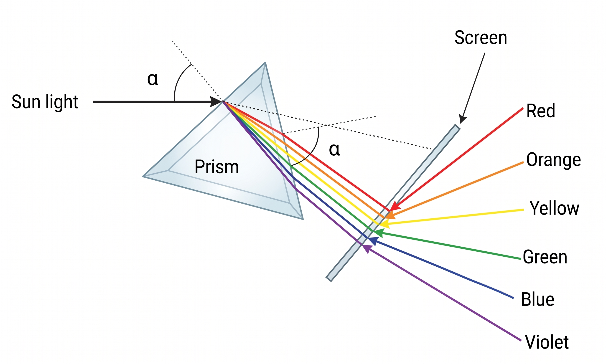
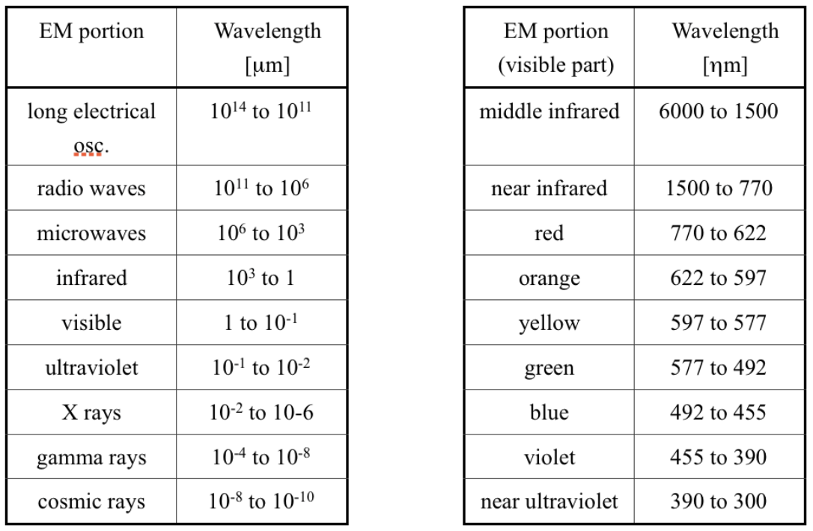
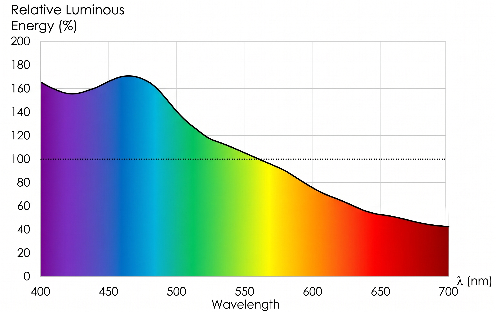
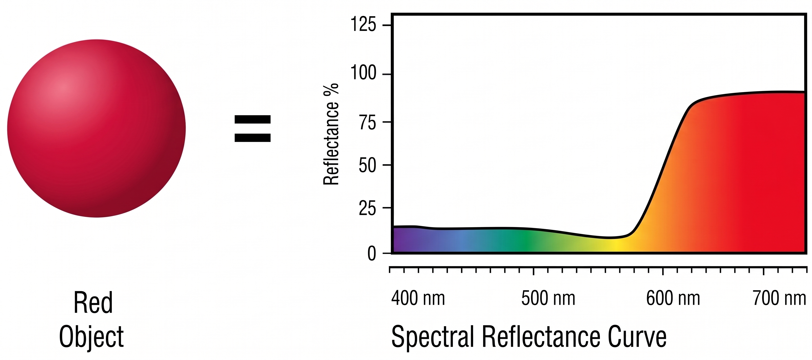
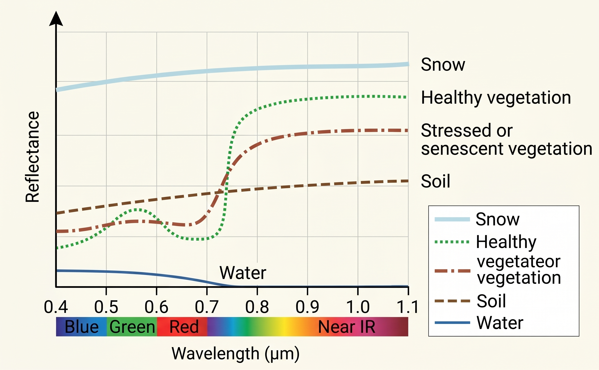
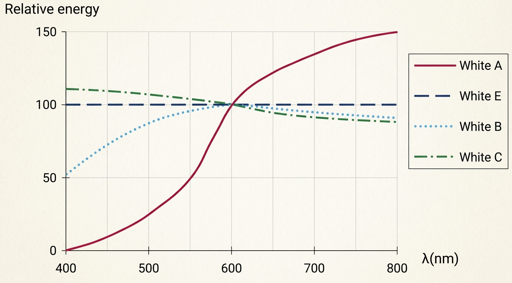
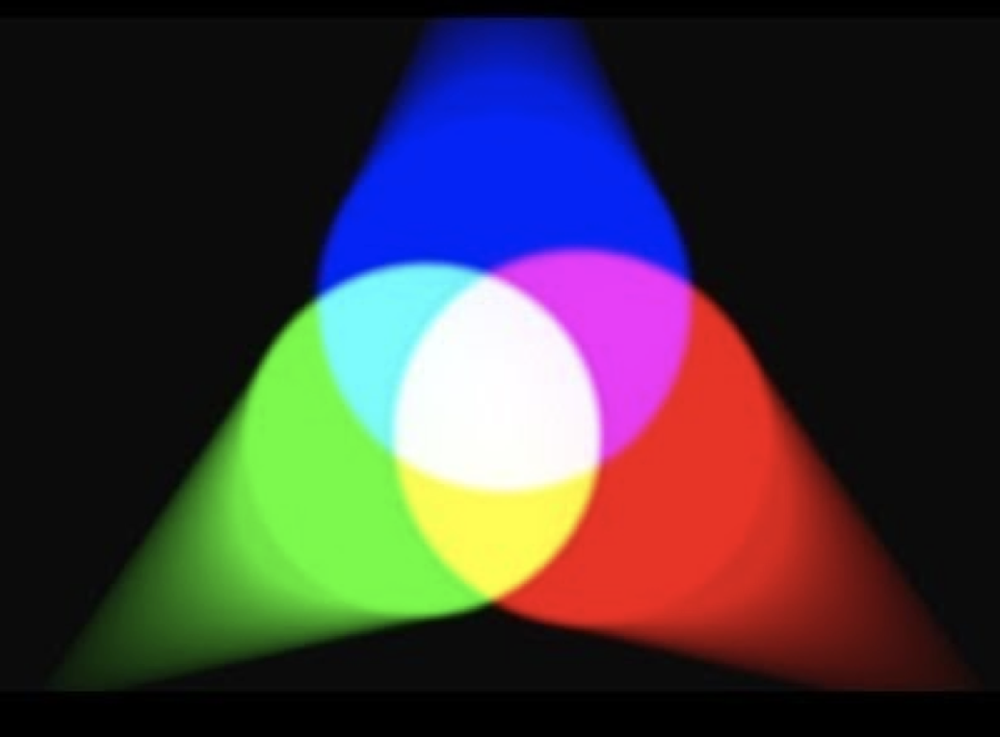
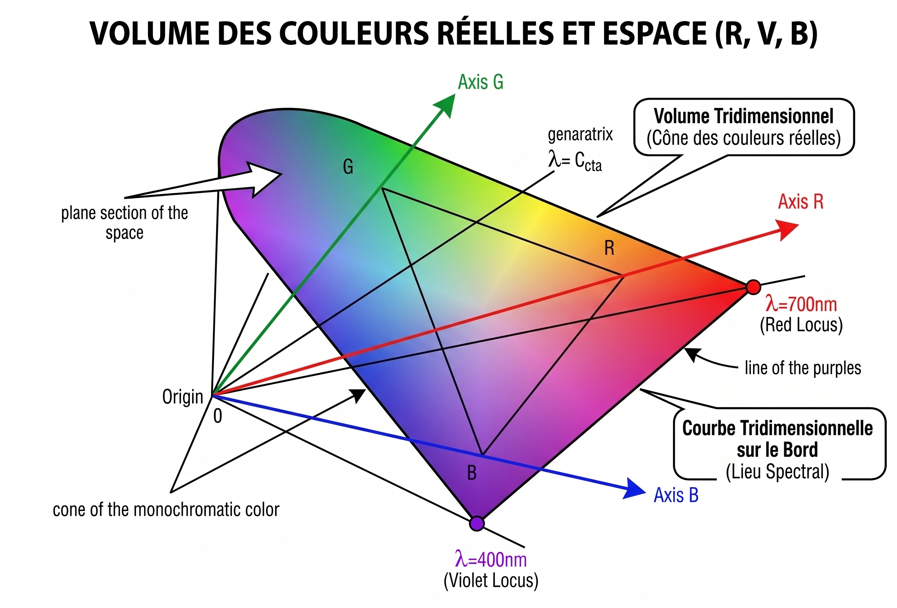
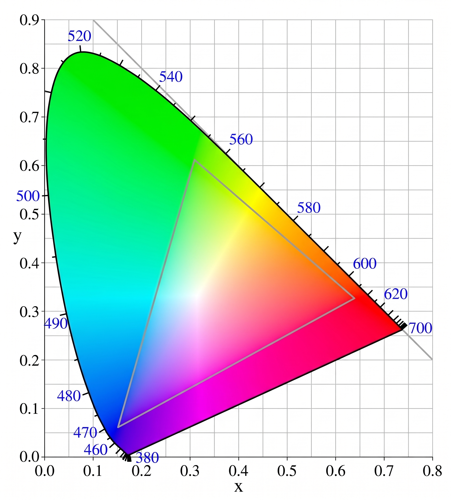

# Images numériques

Dans le monde numérique une image est représentée par une grille, un tableau de pixels.

{#fig-pixel width="50%" fig-align="center"}

Le pixel est le plus petit élément constitutif d'une image, il est indivisible et est souvent stocké comme élément numérique dans une matrice. Le ou les nombres associés au pixel représente une caractéristique de cette partie de l'image, souvent sa couleur. Pour caractériser ces couleurs, il faut d'abord commencer à étudier les caractéristiques de la lumière.


## La lumière

La lumière est un rayonnement électromagnétique composé de photons, c'est-à-dire de particules élémentaires sans masse. Cette énergie est soumise à toutes les lois physiques correspondantes. 
La vitesse de la lumière dans le vide est une constante, notée $c$ et approximativement égale à $300~000$ km/s.
La vitesse de propagation varie en fonction du milieu traversé :

$$
v = \frac{c}{n}
$$ {#eq-vitesse-propagation}

$n$ » dépend des milieux, il est égal à 1 dans le vide.

Une lumière monochromatique possède une fréquence $f$ indépendante du milieu, mais sa longueur d'onde $\lambda$ dépend du milieu.

$$
\lambda = \frac{v}{f}
$$ {#eq-longueur-onde}

Il semble donc évident de caractériser une lumière monochromatique par sa fréquence puisqu'il s'agit d'une constante. Néanmoins, c'est généralement la longueur d'onde (supposée dans le vide) qui est choisie pour la définir.

{#fig-prisme width="90%" fig-align="center"}


Physiquement, la lumière blanche n'existe pas. Le "blanc" n'est pas une longueur d'onde unique, c'est une perception purement biologique et colorimétrique. Elle est le résultat d'une combinaison d'un ensemble de rayonnements. Le prisme de Newton (@fig-prisme) facilite l'observation de cette dispersion lumineuse : émise par le soleil ou par une lampe à incandescence, la lumière traverse le prisme avec un angle d'incidence α par rapport à la normale. Lorsque le rayon lumineux passe de l'air au verre, sa vitesse diminue et sa longueur d'onde se comprime, mais sa fréquence (sa "couleur" fondamentale) reste strictement identique car elle ne dépend que de la source d'émission. Le faisceau change alors de direction et se rapproche de la normale au niveau de la surface de séparation, au point d'incidence. C'est le phénomène de réfraction. Le même phénomène s'observe à la sortie du prisme, lors, par exemple, d'une transition verre-air.

L'angle total de réfraction varie en fonction des longueurs d'onde des rayonnements incidents (la valeur de $\lambda$ la plus élevée correspond aux déviations les plus faibles). Sur un écran blanc situé à la sortie du prisme, on peut observer une bande lumineuse dont la couleur varie progressivement du rouge au violet. À chacun de ces rayonnements (appelés « monochromatiques ») est associée une longueur d'onde (de 400 nm pour le violet jusqu'à 780 nm pour le rouge). 

L'œil perçoit donc des mélanges de lumières monochromatiques dans des proportions différentes. C'est ce qui donne la sensation de couleur.Le spectre électromagnétique des longueurs d'onde s'étend de $10^{-10}$ µm à $10^5$ km. 

Ce spectre est détaillé dans le tableau suivant :

{#fig-spectre width="70%" fig-align="center"}

La lumière peut être représentée par la courbe de distribution spectrale de son énergie lumineuse (répartition du flux énergétique en fonction de la longueur d'onde).

{#fig-lumiere width="90%" fig-align="center"}

## La couleur

La sensation de couleur d'un objet provient du fait qu'une partie de la lumière incidente est réfléchie. On peut donc dire qu'un objet ne possède pas de couleur propre.
La couleur perçue dépend effectivement de :

* la source lumineuse
* la manière dont la lumière se propage
* la sensibilité différentielle de l'œil

Néanmoins, la couleur d'un objet pourrait être complètement définie par sa courbe de réflectance. 

{#fig-reflectance width="90%" fig-align="center"}

Cette courbe représente en pourcentage l'énergie lumineuse réfléchie en fonction de la longueur d'onde incidente.

{#fig-reflectance2 width="90%" fig-align="center"}

### Les différents blancs

Il est nécessaire, dans toute tentative de modélisation, de définir des références.

{#fig-whites width="90%" fig-align="center"}

Le blanc produit par une puissance constante de chacun des rayonnements du spectre visible (BLANC E) est sans doute celui qui semblait le plus logique pour définir ce point de référence. Pourtant, il n'est pas considéré comme tel car il est difficile à produire. Il y a donc trois sources standards qui ont été définies par la Commission Internationale de l'Éclairage (CIE). Celles-ci peuvent être obtenues par un corps noir chauffé jusqu'à incandescence à une certaine température :

* **le blanc A** (éclairage d'une lampe à filament de tungstène) correspond à une température du corps noir de 2848 °K.
* **le blanc B** (lumière du jour à midi en été) correspond à la température du corps noir de 4800 °K.
* **le blanc C** (lumière du soleil filtrée par les nuages) correspond à la température du corps noir de 6500 °K. C'est celui-ci qui a été choisi comme référence.

### Synthèse additive

Une expérience simple et pratique consiste à éclairer un support quelconque avec une lumière donnée. Un observateur doit ensuite reproduire la même valeur, sous la forme d'une tache colorée adjacente, à l'aide d'une ou plusieurs sources monochromatiques (une seule longueur d'onde) dont il peut faire varier l'intensité. De nombreuses expériences de ce type ont mis en évidence plusieurs propriétés intéressantes du système visuel humain.

{#fig-additive width="70%" fig-align="center"}

Si l'observateur ne dispose que d'une seule source monochromatique, il ne pourra apparier son test lumineux avec la référence que si elle possède la même longueur d'onde. Il sera toutefois toujours en mesure d'obtenir une intensité lumineuse équivalente.
En revanche, l'utilisation exclusive de trois sources différentes lui permettra d'apparier pratiquement toutes les lumières testées, à condition que les lumières de référence soient suffisamment éloignées les unes des autres dans le spectre visible. Cela correspond donc respectivement à des sources de longueur d'onde faible (bleu), moyenne (vert) et élevée (rouge).

Si le mélange est réalisé entre les rayonnements extrêmes du spectre, on obtient une plage subjective (qui n'existe pas dans le spectre visible) que l'on appelle « la gamme des pourpres ».

La combinaison de ces paramètres offre une infinité de possibilités. Mais notre oeil ne peut pas toutes les discriminer. De plus, cette différenciation est moins visible dans certaines conditions (lumière faible). On admet généralement que l'œil distingue environ 400.000 couleurs différentes.

### Principes de base et lois

Le principe du procédé trichrome a été formulé par YOUNG, MAXWELL et HELMHOLTZ : « Toute sensation colorée peut être obtenue à partir d'un mélange de trois couleurs judicieusement sélectionnées. Ce mélange peut être soit additif (comme dans l'expérience), soit soustractif (utilisation de filtres). »

Les lois de GRASSMANN ont la même origine. Si $S_1$, $S_2$ et $S_3$ sont les trois sources standards et « $m$ » la couleur à reproduire, alors :

1. Toute couleur peut résulter de la somme de quantités positives ou négatives des trois couleurs primaires. Ces quantités sont uniques.
$$
m = a \cdot S_1 + b \cdot S_2 + c \cdot S_3
$$ {#eq-grassmann-1}

2. Si $a$, $b$ et $c$ (l'énergie de chaque source) varient dans les mêmes proportions (par un facteur $k$), l'équation de la première règle reste valide (loi de proportionnalité).
$$
k \cdot m = (k \cdot a) \cdot S_1 + (k \cdot b) \cdot S_2 + (k \cdot c) \cdot S_3
$$ {#eq-grassmann-2}

**Pour les mélanges additifs (loi d'additivité) :**

Si la couleur $m_1$ est définie par : 
$$
m_1 = a_1 \cdot S_1 + b_1 \cdot S_2 + c_1 \cdot S_3
$$ {#eq-grassmann-add-1}

Et que la couleur $m_2$ est définie par : 
$$
m_2 = a_2 \cdot S_1 + b_2 \cdot S_2 + c_2 \cdot S_3
$$ {#eq-grassmann-add-2}

Alors, le mélange de ces deux couleurs donne :
$$
m_1 + m_2 = (a_1 + a_2) \cdot S_1 + (b_1 + b_2) \cdot S_2 + (c_1 + c_2) \cdot S_3
$$ {#eq-grassmann-add-resultat}

### Le modèle colorimétrique de la CIE (1931)

Comme nous l'avons vu précédemment, le modèle RVB classique pose un problème majeur : il est dépendant du matériel (caméra, écran). Pour pallier ce problème de dérive colorimétrique, la Commission Internationale de l'Éclairage (CIE) a défini en 1931 un modèle mathématique universel. L'objectif était de créer un standard absolu basé sur la perception de l'œil humain, indépendant de tout capteur.

#### L'espace CIE RGB original

Le système a d'abord été défini à partir de trois sources lumineuses primaires monochromatiques de référence :
* **ROUGE :** $700 \, \text{nm}$
* **VERT :** $546,1 \, \text{nm}$
* **BLEU :** $435,8 \, \text{nm}$

Pour une couleur donnée, on détermine les quantités d'énergie $(R, V, B)$ de ces trois primaires nécessaires pour recréer cette couleur (spectre équi-énergétique). 

Cependant, en traitement d'images, on cherche souvent à séparer la **chromaticité** (la couleur pure) de la **luminance** (l'intensité lumineuse). Pour s'affranchir de la luminance, on normalise ces valeurs pour obtenir les coordonnées chromatiques $(r, v, b)$ :

$$
r = \frac{R}{R+V+B} \quad ; \quad v = \frac{V}{R+V+B} \quad ; \quad b = \frac{B}{R+V+B}
$$ {#eq-coefficients-rvb}

Ce qui implique mathématiquement la relation fondamentale suivante (il suffit donc de connaître deux coordonnées pour déduire la troisième) :

$$
r + v + b = 1
$$ {#eq-unite-rvb}

Géométriquement, l'ensemble des couleurs réelles forme alors un volume tridimensionnel (un cône) dans l'espace $(R, V, B)$. Les couleurs du spectre visible (l'arc-en-ciel) se situent sur le bord de ce volume, formant une courbe tridimensionnelle.

{#fig-cone-rgb-3d}

#### L'espace CIE XYZ et le diagramme de chromaticité

Le modèle CIE RGB d'origine impliquait parfois des valeurs négatives pour certaines couleurs très saturées, ce qui était complexe à traiter informatiquement. La CIE a donc créé un espace mathématique virtuel appelé **CIE XYZ**.

Dans cet espace, les primaires $(X, Y, Z)$ sont virtuelles (elles ne correspondent à aucune lumière physique réelle). Elles ont été choisies pour que :
1. Toutes les couleurs réelles aient des coordonnées strictement positives.
2. La coordonnée $Y$ contienne à elle seule toute l'information de **Luminance**.

Comme précédemment, on normalise ces valeurs pour passer dans un espace bidimensionnel en s'affranchissant de la luminosité (projection sur le plan $X+Y+Z=1$) :

$$
x = \frac{X}{X+Y+Z} \quad ; \quad y = \frac{Y}{X+Y+Z} \quad ; \quad z = \frac{Z}{X+Y+Z}
$$ {#eq-coefficients-xyz}

$$
x + y + z = 1
$$ {#eq-unite-xyz}

En projetant ce plan sur les axes $(x, y)$, on obtient le célèbre **Diagramme de chromaticité de la CIE**.

{#fig-icl-chromaticite width="90%" fig-align="center"}

**Lecture du diagramme :**
* **Le lieu spectral (Spectrum Locus) :** C'est la courbe en forme de fer à cheval. Elle représente les couleurs pures (monochromatiques) de 400 nm à 700 nm.
* **La droite des pourpres :** C'est la ligne droite qui relie le rouge extrême et le bleu extrême à la base. Ces couleurs n'existent pas dans le spectre de l'arc-en-ciel, elles sont une invention du cerveau (mélange).
* **Le point blanc (Blanc de référence) :** Il se situe au centre du diagramme. Plus on s'éloigne du centre vers les bords, plus la couleur est saturée.

::: {.callout-important title="L'importance industrielle : le Gamut"}
En vision industrielle, ce diagramme est crucial pour évaluer le **Gamut** d'un équipement. Un capteur de caméra ou un écran de contrôle ne peut reproduire qu'un sous-ensemble (généralement un triangle) des couleurs de ce diagramme. Si un défaut de fabrication sur une ligne de production produit une couleur située en dehors du triangle de votre caméra, votre algorithme sera physiquement incapable de détecter l'anomalie !
:::

#### Évolutions vers l'uniformité (CIE 1960 et 1976)

Le principal défaut du diagramme $(x,y)$ de 1931 est qu'il n'est pas **perceptuellement uniforme** : une même distance mathématique sur le graphique ne correspond pas à la même différence visuelle pour l'œil humain (la zone des verts est disproportionnellement grande).

Pour corriger cela, la CIE a introduit des transformations mathématiques successives (changement de repère) :
* **CIE 1960 (UCS) :** Passage aux coordonnées $(u, v)$.
* **CIE 1976 (CIELUV / CIELAB) :** Passage aux coordonnées $(u', v')$.

Ces espaces sont aujourd'hui la norme pour le contrôle de conformité des couleurs dans l'industrie, car ils permettent de calculer des tolérances d'écarts de couleurs ($\Delta E$) fidèles à la vision des contrôleurs humains.

{#fig-cie-uniforme width="80%" fig-align="center"}


### Les ellipses de MacAdam

Si, dans le diagramme, on trace autour d'une multitude de points $C$ (représentant différentes couleurs) la courbe fermée correspondant au seuil des couleurs tout juste discernables par l'œil humain, on obtient une distribution d'ellipses telle qu'illustrée dans la figure suivante.

Les études de MacAdam fournissent également les paramètres de ces « cellules de confusion » (dimension des deux axes et orientation du grand axe) pour un très grand nombre de points, couvrant une grande partie du diagramme de chromaticité.

On observe sur le diagramme que les dimensions des ellipses sont variables (grandes dans les zones vertes, réduites dans les zones bleues), que leur excentricité est forte et que l'orientation de leur grand axe converge globalement vers le blanc E, l'une des directions suivant l'axe jaune-bleu.

**Figure X : Ellipses de MacAdam**

---

### Couleurs naturelles

En pratique, très peu de couleurs naturelles, lorsqu'elles sont éclairées par le soleil, possèdent une forte saturation. Leur pureté d'excitation est généralement inférieure à 0,5. En revanche, les couleurs artificielles peuvent être beaucoup plus saturées (en particulier les teintes orange, jaune et rouge).

**Figure X : Couleurs naturelles dans le diagramme (x,y)**

Dans le diagramme chromatique $x,y$, la majorité des teintes courantes se situe dans une zone regroupée autour des blancs. Cette zone représente plus ou moins la moitié du diagramme total.

On remarquera également qu'une plage de teintes « chair » (couleur de peau) a été rigoureusement définie afin d'obtenir un meilleur rendu colorimétrique lors des diffusions. L'Union Européenne de Radio-Télévision (UER) centre cette zone de référence sur les coordonnées $x = 0,38$ ; $y = 0,36$.

Ces notions sont particulièrement intéressantes pour le choix et la conception de palettes de couleurs en traitement d'images.

## Création et manipulation d'une image en Python

Maintenant que nous avons défini les fondements théoriques des modèles colorimétriques (et en particulier le modèle RGB), nous pouvons faire le lien avec l'informatique.

### La bibliothèque NumPy

En Python, et plus spécifiquement avec la bibliothèque **NumPy**, une image numérique n'est rien d'autre qu'une matrice mathématique multidimensionnelle (un tableau à 3 dimensions ou *tensor*).

Pour une image couleur standard, cette matrice possède trois dimensions : $(H, W, C)$
*   **$H$ (Height / Hauteur) :** le nombre de lignes (l'axe Y).
*   **$W$ (Width / Largeur) :** le nombre de colonnes (l'axe X).
*   **$C$ (Channels / Canaux) :** la profondeur de la couleur (3 au total, une pour le Rouge, une pour le Vert et une pour le Bleu).

Chaque élément de cette matrice est codé sur 8 bits (type `uint8`), ce qui signifie que l'intensité lumineuse de chaque canal peut varier de 0 (absence de lumière) à 255 (intensité maximale).

Voici un exemple simple permettant de créer numériquement une image entièrement rouge de $200 \times 300$ pixels, en utilisant **NumPy**, puis de l'afficher avec Matplotlib :

```python
# Importation des bibliothèques nécessaires
import numpy as np
import matplotlib.pyplot as plt

# 1. Définition des dimensions de l'image
hauteur = 200
largeur = 300
canaux = 3  # (R, G, B)

# 2. Initialisation d'une matrice noire (remplie de zéros)
# Le type np.uint8 est obligatoire pour que l'image soit reconnue correctement
image_rouge = np.zeros((hauteur, largeur, canaux), dtype=np.uint8)

# 3. Modification des pixels
# En RGB, le rouge pur s'écrit (255, 0, 0)
# Grâce à NumPy, on modifie tous les pixels [:, :] simultanément (vectorisation)
image_rouge[:, :] = [255, 0, 0]

# 4. Affichage de l'image avec Matplotlib (qui attend du RGB)
plt.imshow(image_rouge)
plt.axis('off') # Masque les axes X et Y pour un rendu plus propre
plt.title('Création d\'une image rouge (RGB)')
plt.show()
```

### La bibliothèque OpenCV : le standard industriel

Jusqu'ici, nous avons conceptualisé une image numérique comme une matrice mathématique pure à l'aide de NumPy. Pour des opérations basiques, cela suffit. Cependant, pour le traitement d'images avancé, la lecture de formats complexes (JPEG, PNG, TIFF) ou l'analyse vidéo, le monde académique et industriel s'appuie sur une bibliothèque incontournable : **OpenCV**.

**Qu'est-ce qu'OpenCV ?**
OpenCV (*Open Source Computer Vision Library*) est une bibliothèque open-source de vision par ordinateur extrêmement puissante, initialement développée par Intel en 1999. 
Bien que nous l'utilisions en Python, OpenCV est codée nativement en C et C++. Le module Python (`cv2`) n'est en réalité qu'une "passerelle" (un *wrapper*) qui permet d'appeler ces fonctions C++ ultra-optimisées. C'est ce qui permet à OpenCV de traiter des images et des flux vidéo en temps réel de manière extrêmement rapide.

Dans l'écosystème Python, OpenCV est intelligemment conçu pour interagir directement avec **NumPy** : lorsqu'OpenCV charge une image depuis votre disque dur, il la convertit instantanément en un tableau matriciel NumPy (un *ndarray*).

**Le piège historique de l'espace colorimétrique (BGR vs RGB)**
Il y a une particularité cruciale à mémoriser lors de l'utilisation d'OpenCV. Pour des raisons historiques liées aux standards des fabricants d'écrans et de caméras à la fin des années 90, **OpenCV lit et écrit les images couleur dans l'ordre BGR (Bleu, Vert, Rouge)**, et non dans l'ordre RGB classique utilisé par la quasi-totalité des autres outils informatiques modernes (comme les navigateurs web ou Matplotlib).

Il faut donc toujours adapter ses canaux lors de la création ou de la sauvegarde d'une image avec OpenCV.

**Exemple : Création et sauvegarde d'une image rouge avec OpenCV**

L'exemple suivant montre comment générer une image rouge et l'enregistrer physiquement sur le disque dur à l'aide de la fonction `cv2.imwrite()`. 

```python
import numpy as np
import cv2

# 1. Définition des dimensions (Hauteur, Largeur, Canaux)
hauteur = 200
largeur = 300
canaux = 3

# 2. Création de la matrice noire (remplie de zéros)
# Le type uint8 (entier non signé sur 8 bits : 0-255) est requis par OpenCV
image = np.zeros((hauteur, largeur, canaux), dtype=np.uint8)

# 3. Colorisation de l'image (Attention à l'ordre BGR !)
# Pour obtenir du rouge pur, on définit : Bleu = 0, Vert = 0, Rouge = 255
# Le vecteur s'écrit donc [0, 0, 255]
image[:, :] = [0, 0, 255]

# 4. Sauvegarde de l'image sur le disque dur
# La fonction imwrite prend en paramètre le nom du fichier (avec son extension) et la matrice
succes = cv2.imwrite('mon_image_rouge.png', image)

if succes:
    print("L'image a été sauvegardée avec succès dans le dossier courant.")
else:
    print("Erreur lors de la sauvegarde de l'image.")
```

Vous remarquerez que Matplotlib n'est pas utilisé dans ce code, pour bien montrer que l'environnement matriciel NumPy couplé directement à l'I/O (Input/Output) d'OpenCV suffit parfois. Vous devez bien dissocier "l'outil qui calcule et sauvegarde" (OpenCV) de "l'outil qui dessine des graphiques à l'écran" (Matplotlib).

## Exercices de réflexion

Pour consolider les notions d'espace colorimétrique et de représentation matricielle, répondez aux questions suivantes.

::: {.callout-note icon="false"}
### Exercice 1 : Calcul de taille théorique
Déterminez la place qu'occupe une image de 653 lignes sur 657 colonnes si elle est sauvegardée sans compression de données. Expliquez votre calcul.
:::

::: {.callout-tip collapse="true"}
### Voir la réponse et l'explication
**Calcul du nombre de pixels :**
L'image possède $653 \times 657 = 429~021$ pixels.

**Calcul du poids en mémoire :**
La taille dépend de la profondeur de couleur (le nombre de canaux) :
*   **En niveaux de gris (1 canal, 8 bits/pixel) :** 
    $429~021 \times 1 = 429~021$ octets (soit environ $419$ Ko).
*   **En couleur RGB (3 canaux, 24 bits/pixel) :** 
    $429~021 \times 3 = 1~287~063$ octets (soit environ $1,23$ Mo).
:::

::: {.callout-note icon="false"}
### Exercice 2 & 3 : Pratique et réalité physique
1. Vérifiez la taille trouvée précédemment avec la place réellement occupée par le fichier `cat.bmp` sur votre ordinateur.
2. Expliquez pourquoi la taille théorique calculée n'est pas *exactement* la taille affichée sur le disque dur.
:::

::: {.callout-tip collapse="true"}
### Voir la réponse et l'explication
Si vous inspectez les propriétés du fichier `cat.bmp`, vous constaterez une légère différence avec le calcul théorique. Cela s'explique par trois facteurs informatiques :

1.  **L'en-tête du fichier (Header) :** Un fichier image ne contient pas que des pixels. Le format BMP, par exemple, inclut un en-tête (généralement de 54 octets) qui stocke les métadonnées (largeur, hauteur, type d'encodage) indispensables pour que le logiciel sache comment lire la matrice.
2.  **L'alignement en mémoire (Padding) :** Le format BMP exige que la taille de chaque ligne d'une image soit un multiple de 4 octets. Si ce n'est pas le cas (comme ici avec 657 colonnes), le système ajoute des octets vides ("padding") à la fin de chaque ligne pour faciliter la lecture par le processeur.
3.  **L'allocation sur le disque (Taille des clusters) :** Votre système d'exploitation (Windows, macOS) découpe le disque dur en "blocs" de taille fixe (souvent 4 Ko). Même si un fichier dépasse d'un seul octet sur un nouveau bloc, l'intégralité du bloc est réservée. La "taille sur le disque" est donc souvent légèrement supérieure à la taille réelle du fichier.
:::

::: {.callout-note icon="false"}
### Exercice 4 & 5 : Limites de la perception humaine
1. Calculez le nombre de couleurs que l'on peut coder sur un format classique 3x8 bits (RGB standard).
2. Ce nombre de couleurs est-il « suffisant » par rapport aux capacités de la vision humaine ?
:::

::: {.callout-tip collapse="true"}
### Voir la réponse et l'explication
**Calcul du nombre de couleurs :**
En RGB 3x8 bits, chaque canal (Rouge, Vert, Bleu) peut prendre 256 valeurs ($2^8$).
Le nombre de combinaisons possibles est donc : 
$256 \times 256 \times 256 = 16~777~216$ de couleurs (environ 16,7 millions).

**Est-ce suffisant ?**
Comme vu dans le chapitre sur la colorimétrie, l'œil humain est capable de distinguer environ 400 000 couleurs différentes (jusqu'à 2 millions selon les études et la luminosité). Mathématiquement, 16,7 millions est donc largement suffisant pour tromper notre cerveau. 
*Toutefois*, dans des cas très précis comme des dégradés de couleurs très doux (ex: un ciel bleu), l'œil est sensible aux sauts d'intensité, créant un effet d'escalier appelé *banding* (postérisation). C'est pourquoi les caméras professionnelles et les écrans HDR travaillent souvent en 10 ou 12 bits par canal (plus d'un milliard de couleurs) afin d'assurer des transitions parfaitement fluides.
:::

::: {.callout-note icon="false"}
### Exercice 6 : Le canal supplémentaire
Lors de vos lectures ou de l'utilisation d'outils de design, vous croiserez souvent le modèle **RGBA**. Recherchez la signification et l'utilité du "A".
:::

::: {.callout-tip collapse="true"}
### Voir la réponse et l'explication
Le **A** signifie **Alpha** (le canal Alpha).

Il ne représente pas une couleur, mais le niveau d'**opacité** (ou de transparence) du pixel. 
* Si Alpha = 255, le pixel est totalement opaque.
* Si Alpha = 0, le pixel est totalement transparent.

Ce quatrième canal est fondamental dans le traitement d'images pour le *compositing* (la superposition d'images), le détourage, ou la création d'interfaces graphiques (comme les icônes sur un fond d'écran ou le rendu d'une page web). Un pixel RGBA nécessite donc 4 octets de mémoire (32 bits) au lieu de 3.
:::

## Exercices de programmation : Création d'images matricielles

Dans les exercices suivants, utilisez **NumPy** pour initialiser vos matrices et **OpenCV** (`cv2.imwrite`) pour sauvegarder le résultat sur votre disque. 

*Rappel : OpenCV utilise l'espace colorimétrique BGR (Bleu, Vert, Rouge) !*

::: {.callout-note icon="false"}
### Exercice 1 : Le drapeau national
Créez une image de 300 pixels de haut sur 300 pixels de large représentant le drapeau de la Belgique (trois bandes verticales de largeur égale : Noir, Jaune, Rouge). Sauvegardez-la sous le nom `drapeau.png`.
:::

::: {.callout-note icon="false"}
### Exercice 2 : Les 4 quadrants
Créez une image carrée de 400x400 pixels, divisée en 4 carrés égaux (200x200). 
Attribuez les couleurs suivantes aux quadrants :
* En haut à gauche : Bleu pur
* En haut à droite : Vert pur
* En bas à gauche : Rouge pur
* En bas à droite : Blanc pur
:::

::: {.callout-note icon="false"}
### Exercice 3 : Le cadre coloré
Créez une image de 500x500 pixels. Le fond de l'image doit être jaune pur, mais elle doit posséder une bordure bleue épaisse de 20 pixels sur tout son périmètre. 
*Astuce d'optimisation : Pensez à la manière dont un peintre peint une toile pour le faire en seulement 2 lignes de code, sans dessiner 4 rectangles distincts !*
:::

::: {.callout-note icon="false"}
### Exercice 4 (Défi) : Le dégradé linéaire
Créez une image de 256 pixels de haut sur 256 pixels de large. 
Générez un dégradé horizontal allant du Noir pur (à gauche) vers le Rouge pur (à droite). 
*Indice : Renseignez-vous sur la fonction `np.linspace` ou `np.arange` de NumPy, et profitez du mécanisme de "broadcasting" pour éviter d'utiliser des boucles `for`.*
:::

---
