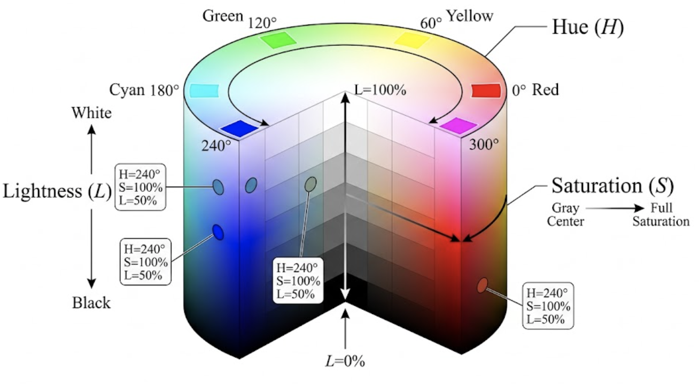

# Le codage des couleurs

## Le codage RGB (RVB)

Nous avons vu qu'une couleur peut donc être définie par trois valeurs. Le système RVB repose sur une synthèse additive de 3 couleurs de base: le rouge, le vert et le bleu. On les appelle les trois composantes. Généralement, les valeurs de ces composantes sont comprises entre 0 et 255 (un octet). Il est donc possible de coder 16.777.216 couleurs différentes.  Si chacune des composantes est à son maximum, le résultat est blanc ; si chacune est à son minimum, le résultat est noir (absence de lumière). Si nous avons la même proportion de rouge, de bleu et de vert, nous obtenons un niveau de gris. L'augmentation d'une composante accroît la luminosité du résultat.

| Aperçu | Couleur | Rouge (R) | Vert (V) | Bleu (B) | Remarque |
| :---: | :--- | :---: | :---: | :---: | :--- |
| <span style="display:inline-block; width:18px; height:18px; background-color:rgb(0,0,0); border:1px solid #777; border-radius:3px;"></span> | **Noir pur** | 0 | 0 | 0 | Absence totale de lumière (minimum) |
| <span style="display:inline-block; width:18px; height:18px; background-color:rgb(64,64,64); border:1px solid #777; border-radius:3px;"></span> | **Gris foncé** | 64 | 64 | 64 | Les 3 valeurs sont égales et basses |
| <span style="display:inline-block; width:18px; height:18px; background-color:rgb(128,128,128); border:1px solid #777; border-radius:3px;"></span> | **Gris moyen** | 128 | 128 | 128 | |
| <span style="display:inline-block; width:18px; height:18px; background-color:rgb(192,192,192); border:1px solid #777; border-radius:3px;"></span> | **Gris clair** | 192 | 192 | 192 | Les 3 valeurs sont égales et élevées |
| <span style="display:inline-block; width:18px; height:18px; background-color:rgb(255,255,255); border:1px solid #777; border-radius:3px;"></span> | **Blanc pur** | 255 | 255 | 255 | Addition maximale des 3 lumières |
| <span style="display:inline-block; width:18px; height:18px; background-color:rgb(255,0,0); border:1px solid #777; border-radius:3px;"></span> | **Rouge pur** | 255 | 0 | 0 | |
| <span style="display:inline-block; width:18px; height:18px; background-color:rgb(100,0,0); border:1px solid #777; border-radius:3px;"></span> | **Rouge foncé**| 100 | 0 | 0 | Baisse de la valeur R = baisse de luminosité |
| <span style="display:inline-block; width:18px; height:18px; background-color:rgb(255,255,0); border:1px solid #777; border-radius:3px;"></span> | **Jaune pur** | 255 | 255 | 0 | Synthèse de Rouge + Vert |
| <span style="display:inline-block; width:18px; height:18px; background-color:rgb(0,255,255); border:1px solid #777; border-radius:3px;"></span> | **Cyan pur** | 0 | 255 | 255 | Synthèse de Vert + Bleu |
| <span style="display:inline-block; width:18px; height:18px; background-color:rgb(255,0,255); border:1px solid #777; border-radius:3px;"></span> | **Magenta pur**| 255 | 0 | 255 | Synthèse de Rouge + Bleu |

: Exemples de couleurs et leurs composantes RVB respectives {#tbl-valeurs-rgb}

Malheureusement, ce système de codage n'est pas très satisfaisant. Dans le domaine informatique, le codage RVB est dépendant du périphérique. Cela entraîne une dérive colorimétrique qui doit être corrigée par calibrage.

Cependant, le modèle RGB (Rouge, Vert, Bleu) est probablement le plus utilisé, mais comme nous allons le voir dans la suite, il n'est pas le seul.

Comment lire une image avec Python ?

```python
import cv2
import sys

# 1. Chargement de l'image
chemin_image = "images/mon_image.jpg" # À adapter avec une image de votre dossier
image = cv2.imread(chemin_image)

# Sécurité : vérifier que l'image a bien été trouvée et chargée
if image is None:
    print(f"Erreur : Impossible de lire le fichier '{chemin_image}'")
    sys.exit()

# 2. Choix des coordonnées du pixel à analyser
x = 120  # Colonne (axe horizontal)
y = 50   # Ligne (axe vertical)

# 3. Lecture des composantes du pixel
# ATTENTION : En numpy/matriciel, on lit d'abord la ligne, puis la colonne, donc [y, x]
pixel = image[y, x]

# 4. Extraction des couleurs
# PIÈGE CLASSIQUE : OpenCV utilise nativement le format BGR, et non RGB !
b = pixel[0] # Bleu (Blue)
g = pixel[1] # Vert (Green)
r = pixel[2] # Rouge (Red)

# 5. Affichage des résultats
print(f"Analyse du pixel aux coordonnées matricielles (Y={y}, X={x}) :")
print(f"-> Tableau brut retourné par OpenCV (BGR) : {pixel}")
print(f"-> Composante Rouge (R) : {r}")
print(f"-> Composante Verte (V) : {g}")
print(f"-> Composante Bleue (B) : {b}")
```

::: {.callout-note icon="false"}
### Exercice : Décomposition des canaux RGB
Chargez d'abord une image en couleur (par exemple, le `clown.png`), décomposez-le en ses trois composantes R, G et B que vous affichez dans trois fenêtres différentes.
:::

## Le modèle HSL (Hue, Saturation, Luminance ou en français TSL : Teinte, Saturation, Luminosité)

Le modèle HSL a été décrit par MUNSELL en 1905 et est plus proche de la manière dont un humain donne la description d'une couleur. En effet, si vous écoutez une quelqu'un décrire une couleur, on pourrait entendre : « Je cherche un bleu pastel très clair ». On retrouve dans cette phrase les notions fondamentales de teinte (bleu), de saturation (pastel) et de luminosité (très clair).

Notre cerveau agit donc comme un intégrateur qui détecte trois grandeurs physiques distinctes :
* **La teinte (Hue) :** caractérisée par la longueur d'onde dominante du rayonnement (± 250 teintes monochromatiques détectables par l'œil, plus les pourpres).
* **La luminosité ou clarté (Lightness) :** l'énergie lumineuse reçue (± 1000 niveaux de luminosité différents, selon la teinte).
* **La saturation (Saturation ou pureté de la couleur) :** contribue à l'intensité de l'ensemble et permet de différencier une couleur vive d'une couleur pastel (atténuée) (± 20 000 différenciations).

Une couleur pure (un rouge flamboyant) sera donc saturée à 100 % et quand la saturation atteint 0%, il n'y a plus de dominante de couleur. La couleur est dite achromatique (absence de couleur) et révèle une nuance de gris, allant du blanc au noir selon la luminosité.

| Aperçu | Couleur | Teinte (H) | Saturation (S) | Luminosité (L) | Remarque |
| :---: | :--- | :---: | :---: | :---: | :--- |
| <span style="display:inline-block; width:18px; height:18px; background-color:hsl(0,0%,0%); border:1px solid #777; border-radius:3px;"></span> | **Noir pur** | 0° | 0% | 0% | Luminosité à 0 = noir total, peu importe H et S |
| <span style="display:inline-block; width:18px; height:18px; background-color:hsl(0,0%,50%); border:1px solid #777; border-radius:3px;"></span> | **Gris moyen** | 0° | 0% | 50% | Saturation à 0 = absence de pigment (nuance de gris) |
| <span style="display:inline-block; width:18px; height:18px; background-color:hsl(0,0%,100%); border:1px solid #777; border-radius:3px;"></span> | **Blanc pur** | 0° | 0% | 100% | Luminosité à 100 = blanc pur, peu importe H et S |
| <span style="display:inline-block; width:18px; height:18px; background-color:hsl(0,100%,50%); border:1px solid #777; border-radius:3px;"></span> | **Rouge pur** | 0° | 100% | 50% | Couleur fondamentale (0° = début du cercle chromatique) |
| <span style="display:inline-block; width:18px; height:18px; background-color:hsl(0,100%,25%); border:1px solid #777; border-radius:3px;"></span> | **Rouge foncé**| 0° | 100% | 25% | On baisse L : on assombrit la même couleur |
| <span style="display:inline-block; width:18px; height:18px; background-color:hsl(0,100%,75%); border:1px solid #777; border-radius:3px;"></span> | **Rouge clair**| 0° | 100% | 75% | On monte L : on éclaircit la même couleur |
| <span style="display:inline-block; width:18px; height:18px; background-color:hsl(0,30%,50%); border:1px solid #777; border-radius:3px;"></span> | **Rouge délavé**| 0° | 30% | 50% | On baisse S : la couleur devient fade (tend vers le gris) |
| <span style="display:inline-block; width:18px; height:18px; background-color:hsl(120,100%,50%); border:1px solid #777; border-radius:3px;"></span> | **Vert pur** | 120° | 100% | 50% | Décalage d'un tiers (120°) sur le cercle chromatique |
| <span style="display:inline-block; width:18px; height:18px; background-color:hsl(240,100%,50%); border:1px solid #777; border-radius:3px;"></span> | **Bleu pur** | 240° | 100% | 50% | Décalage de deux tiers (240°) sur le cercle chromatique |

: Exemples de couleurs et leurs composantes TSL/HSL respectives {#tbl-valeurs-hsl}

Vous remarquerez la teinte n'est pas donnée par une valeur entre 0 et 255 mais bien entre 0 et 360. H est donné en degré car elle est souvent réprésentée sur un cercle qui se transforme en cylindre avec la saturation et la luminance.

{#fig-cylindre-hsl}

Comme on peut l'observer sur la @fig-cylindre-hsl :
- **La Teinte (H)** tourne autour de l'axe central (de 0° à 360°).
- **La Saturation (S)** part de l'axe central gris (0%) vers le bord coloré du cylindre (100%).
- **La Luminosité (L)** monte de la base noire (0%) vers le sommet blanc (100%).

### Conversion Mathématique entre RVB et TSL (HSL)

Pour passer d'un espace colorimétrique à l'autre, les algorithmes (comme ceux intégrés dans OpenCV) utilisent une série d'opérations non linéaires. 

Pour réaliser une conversion de RVB vers TSL (HSL) :

La première étape consiste toujours à **normaliser** les valeurs RVB de l'intervalle $[0, 255]$ vers l'intervalle $[0, 1]$. On note ces valeurs normalisées $R', G', B'$.

On cherche ensuite la composante maximale ($C_{max}$), la composante minimale ($C_{min}$) et la différence entre les deux ($\Delta$).

$$
\begin{aligned}
C_{max} &= \max(R', G', B') \\
C_{min} &= \min(R', G', B') \\
\Delta &= C_{max} - C_{min}
\end{aligned}
$$

**Calcul de la Luminosité (L) :**
La luminosité est simplement la moyenne entre la composante la plus forte et la plus faible.
$$ L = \frac{C_{max} + C_{min}}{2} $$

**Calcul de la Saturation (S) :**
Si $\Delta = 0$ (c'est-à-dire que $R=G=B$), la couleur est une nuance de gris, donc la saturation est nulle.
$$
S = \begin{cases} 
0 & \text{si } \Delta = 0 \\
\frac{\Delta}{1 - |2L - 1|} & \text{sinon}
\end{cases}
$$

**Calcul de la Teinte (H) :**
La teinte est calculée selon le secteur du cercle chromatique (par tranches de 60°) dominé par la couleur principale.
$$
H = \begin{cases} 
0^\circ & \text{si } \Delta = 0 \\
60^\circ \times \left( \frac{G' - B'}{\Delta} \bmod 6 \right) & \text{si } C_{max} = R' \\
60^\circ \times \left( \frac{B' - R'}{\Delta} + 2 \right) & \text{si } C_{max} = G' \\
60^\circ \times \left( \frac{R' - G'}{\Delta} + 4 \right) & \text{si } C_{max} = B'
\end{cases}
$$
*(Si $H < 0^\circ$, on lui ajoute $360^\circ$ pour obtenir un angle positif).*

---

Pour la conversion inverse de TSL (HSL) vers RVB :

On utilise la Teinte ($H \in [0, 360[$), la Saturation ($S \in [0, 1]$) et la Luminosité ($L \in [0, 1]$) pour retrouver $R, G, B$.

On calcule d'abord les paramètres intermédiaires suivants (le Chroma $C$, un paramètre $X$ et un ajustement de luminosité $m$) :
$$
\begin{aligned}
C &= (1 - |2L - 1|) \times S \\
X &= C \times \left(1 - \left| \left(\frac{H}{60^\circ}\right) \bmod 2 - 1 \right|\right) \\
m &= L - \frac{C}{2}
\end{aligned}
$$

On détermine ensuite les valeurs RVB temporaires $(R', G', B')$ en fonction de l'angle de la Teinte $H$ :
$$
(R', G', B') = \begin{cases} 
(C, X, 0) & \text{si } 0^\circ \le H < 60^\circ \\
(X, C, 0) & \text{si } 60^\circ \le H < 120^\circ \\
(0, C, X) & \text{si } 120^\circ \le H < 180^\circ \\
(0, X, C) & \text{si } 180^\circ \le H < 240^\circ \\
(X, 0, C) & \text{si } 240^\circ \le H < 300^\circ \\
(C, 0, X) & \text{si } 300^\circ \le H < 360^\circ 
\end{cases}
$$

Enfin, on ajoute l'ajustement de luminosité $m$ et on dé-normalise pour retrouver les valeurs classiques sur un octet (0 à 255) :
$$
\begin{aligned}
R &= (R' + m) \times 255 \\
G &= (G' + m) \times 255 \\
B &= (B' + m) \times 255
\end{aligned}
$$

::: {.callout-note title="Question de réflexion : La non-linéarité du modèle"}
**Pourquoi la transformation RVB $\rightarrow$ TSL est-elle non linéaire, et quelles en sont les implications concrètes en traitement d'images industriel ?**
:::
::: {.callout-tip collapse="true"}
### Voir la réponse et l'explication
**1. Pourquoi est-ce non linéaire ?**
Contrairement au passage en niveaux de gris qui est une simple combinaison linéaire (une multiplication matricielle), la conversion vers le TSL utilise des opérations conditionnelles (fonctions $\max$ et $\min$), des valeurs absolues et des divisions. Géométriquement, l'algorithme "déforme" un cube (l'espace RVB) pour l'enrouler et le faire rentrer dans un cylindre. Cette torsion mathématique a pour but de s'aligner sur la perception visuelle de l'œil humain, qui est elle-même fortement non linéaire.

**2. Les implications sur le terrain (vision industrielle) :**
Cette non-linéarité a trois conséquences majeures à prendre en compte lors du développement de vos algorithmes de contrôle qualité :

* **L'instabilité de la Teinte (Singularités) :** Lorsque la saturation est très faible (sur des objets gris/métalliques) ou que l'image est très sombre/très surexposée, la différence $\Delta$ s'approche de $0$. Une infime variation de lumière ou un bruit de capteur (même de 1 bit sur un pixel) va faire bondir l'angle de la Teinte de manière chaotique. 
*$\rightarrow$ Règle d'or : ne jamais baser une segmentation sur la Teinte si la Saturation ou la Luminosité sont trop faibles.*
* **Le problème de la circularité (Mathématique modulo) :** La Teinte est un angle. Les valeurs $0^\circ$ (rouge) et $359^\circ$ (rouge) sont visuellement identiques mais numériquement opposées. Vous ne pouvez donc pas utiliser de simples moyennes mathématiques ou de distances euclidiennes sur la Teinte. (Par exemple, dans OpenCV, isoler la couleur rouge requiert souvent de créer deux masques : de 0 à 10 et de 170 à 179, puis de les additionner).
* **Le coût de calcul (CPU) :** Les divisions, les modulos et les branchements conditionnels (`if`) demandent plus de cycles d'horloge au processeur qu'une simple addition matricielle. Sur des lignes de production à cadence très élevée (milliers de pièces par minute), convertir une image haute résolution de RVB à TSL coûte un temps de traitement précieux qu'il faut estimer.
:::

::: {.callout-note icon="false"}
### Exercice : Décomposition des canaux HSL avec les formules
Chargez d'abord une image en couleur (par exemple, le `clown.png`), EN UTILISANT les formules ci-dessus, décomposez l'image en ses trois composantes H, S et L que vous affichez dans trois fenêtres différentes. Posez-vous d'abord la question de savoir comment afficher une composante dont l'unité est en degré et comment afficher une saturation.
:::

::: {.callout-note icon="false"}
### Exercice : Décomposition des canaux HSL en utilisant opencv
Refaites l'exercice précédent en utilisant la librairie opencv. Comparez et commentez les résultats.
:::

::: {.callout-note icon="false"}
### Exercice : Décomposition des canaux HSL en utilisant opencv
Créez en utilisant la librairie opencv et les paramètres HSL, une image toute rouge (H=0, S=1, L=1). Comparez avec l'image rouge générée plus haut.
:::