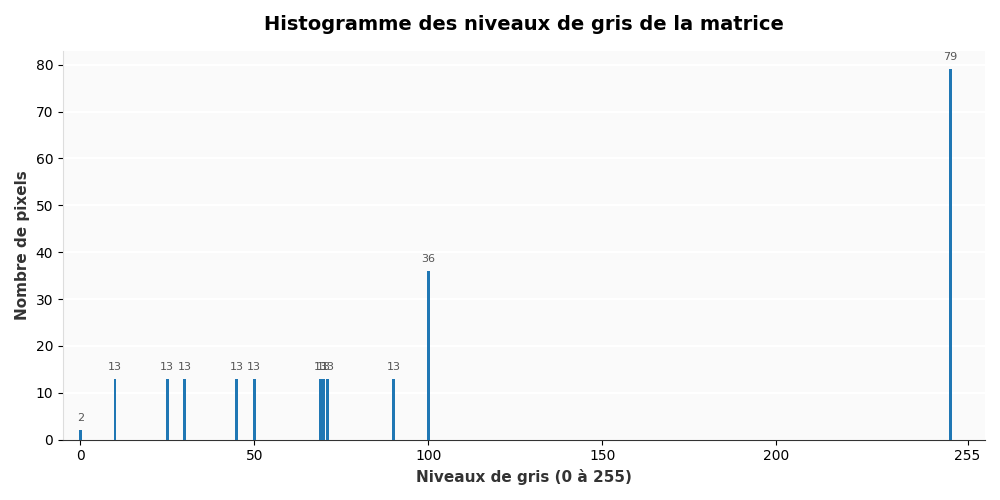
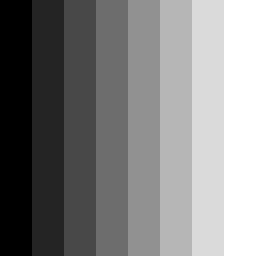
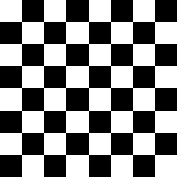
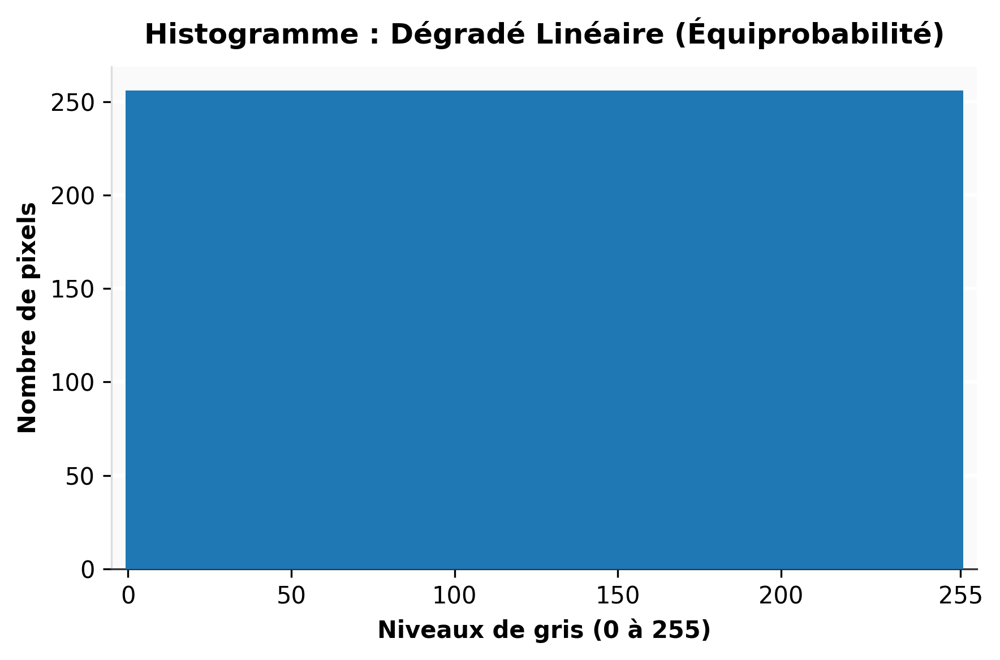
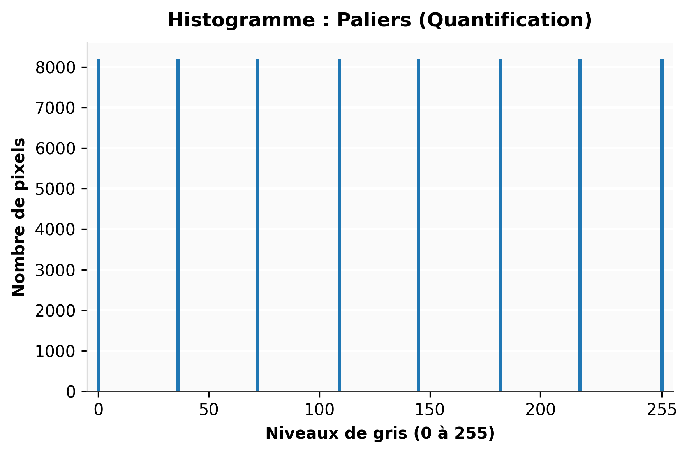
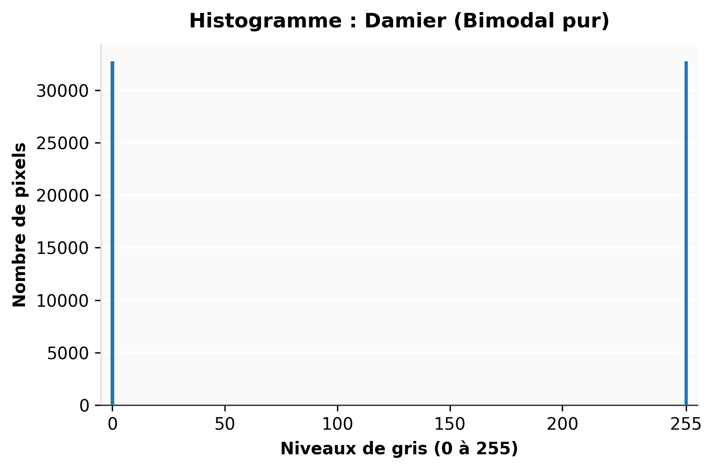
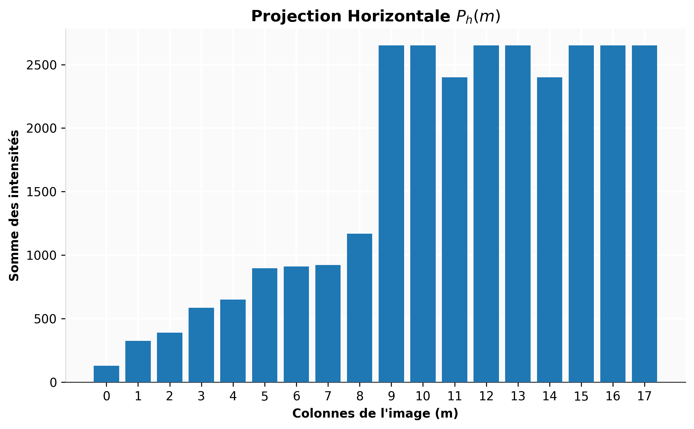
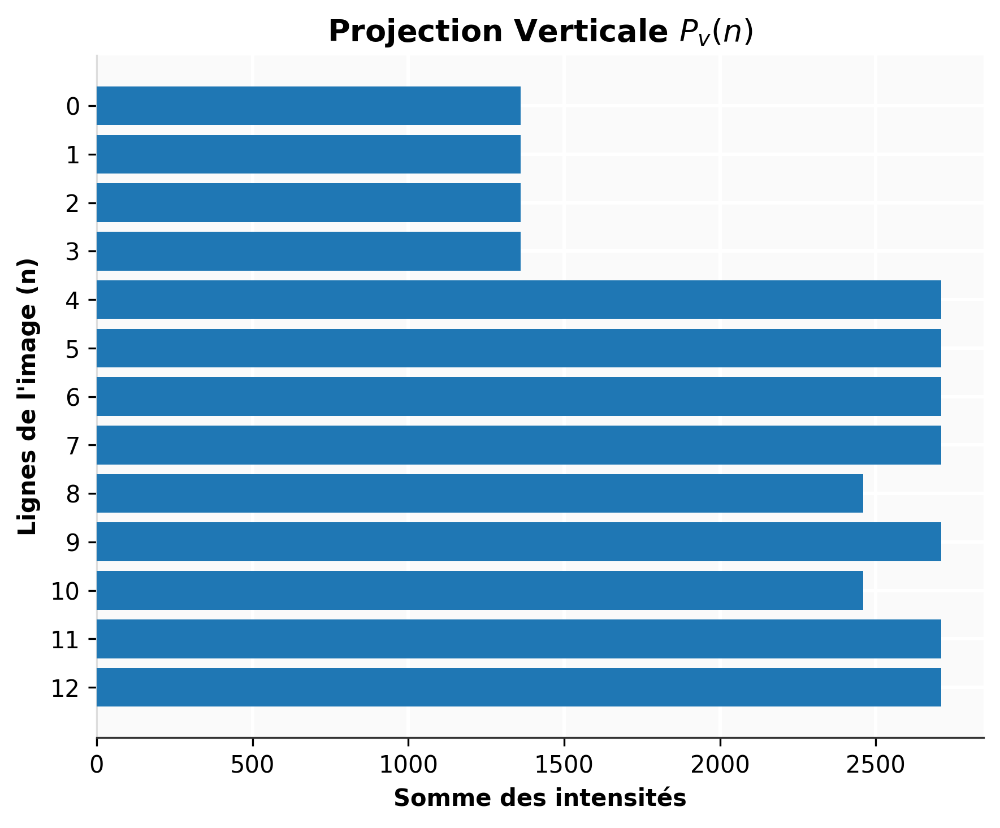

# Opérations statistiques

### Opérations statistiques

Les **opérations statistiques** (comme le calcul de l'histogramme ou des projections) n'altèrent pas directement l'image, mais en extraient des informations mathématiques globales sur la distribution et la géométrie des images. Elles constituent une étape d'analyse primordiale en vision industrielle pour automatiser la prise de décision, qu'il s'agisse de déterminer le seuil optimal d'une binarisation ou de localiser rapidement des anomalies de surface.

Considèrons une image comme étant définie par une matrice $N \times M$ de coordonnées $(n,m)$ avec $n=0,1,\dots,N-1$ et $m=0,1,\dots,M-1$ et que la valeur des pixels est établie par une échelle de gris notée $$g(n,m)$. 

## L'histogramme

Un graphique illustrant la probabilité d'apparition de chaque valeur de pixel dans une image est appelé un histogramme. Pour construire un histogramme, il faut d'abord compter le nombre total de pixels pour chaque valeur possible présente dans l'image (noté $n_f$). Ensuite, on divise chacun de ces décomptes par le nombre total de pixels de l'image ($N \times M$) pour obtenir la valeur de probabilité. Toutes ces valeurs sont représentées dans un graphique $\text{probabilité} = h_f(f)$, où $f$ représente le niveau de gris :

$$h_f(f) = \frac{n_f}{N \times M} \quad (6.1)$$

Cette méthode est généralement appliquée à une échelle de gris mais peut également être appliquée à une seule composante d'une couleur. Nous verrons plus tard que l'histogramme permet, par exemple, de choisir une table de correspondance (LookUpTable) ou une palette de couleurs.

Nous pouvons également définir l'histogramme cumulé $H_f(f)$ qui représente le pourcentage de pixels ayant un niveau de gris inférieur ou égal à $f$ :

$$H_f(f) = \sum_{j=0}^{f} h_f(j) \quad (6.2)$$

**Exemple :** À partir de maintenant, les exemples utiliseront cette matrice de nombres (qui peut représenter les niveaux de gris d'une image) :

```text
 10  25  30  45  50  69  70  71  90  100 100 100 100 100 100 100 100 100
 10  25  30  45  50  69  70  71  90  100 100 100 100 100 100 100 100 100
 10  25  30  45  50  69  70  71  90  100 100 100 100 100 100 100 100 100
 10  25  30  45  50  69  70  71  90  100 100 100 100 100 100 100 100 100
 10  25  30  45  50  69  70  71  90  250 250 250 250 250 250 250 250 250
 10  25  30  45  50  69  70  71  90  250 250 250 250 250 250 250 250 250
 10  25  30  45  50  69  70  71  90  250 250 250 250 250 250 250 250 250
 10  25  30  45  50  69  70  71  90  250 250 250 250 250 250 250 250 250
 10  25  30  45  50  69  70  71  90  250 250 250 250 250   0 250 250 250
 10  25  30  45  50  69  70  71  90  250 250 250 250 250 250 250 250 250
 10  25  30  45  50  69  70  71  90  250 250   0 250 250 250 250 250 250
 10  25  30  45  50  69  70  71  90  250 250 250 250 250 250 250 250 250
 10  25  30  45  50  69  70  71  90  250 250 250 250 250 250 250 250 250

```

{#fig-histogramme-exemple}

::: {.callout-note icon="false"}
### Exercice : Créer des images de test en niveaux de gris
Pour faire des exercices, nous allons créer trois images de test :
:::

::: {layout-ncol="2"}
{#fig-mire-degrade}
:::

::: {layout-ncol="2"}
{#fig-mire-paliers}
:::

::: {layout-ncol="2"}
{#fig-mire-damier}
:::


::: {.callout-note icon="false"}
### Exercice : Dessiner la LUT pour ces trois images
A partir des trois images précédemment créées, calculer et dessiner leur LUT respective.
:::

{#fig-hist-degrade}

*Le dégradé linéaire parfait distribue les pixels uniformément sur les 256 niveaux.*

{#fig-hist-paliers}

*L'échelle à paliers illustre le phénomène de quantification spatiale.*


{#fig-hist-damier}

*Le damier représente une distribution bimodale absolue, idéale pour démontrer le principe du seuillage.*


## Projection

La projection d'une image consiste à accumuler (sommer) ou moyenner les valeurs des amplitudes de pixels le long d'un axe spécifique (lignes ou colonnes). Cette opération permet de réduire une image bidimensionnelle en un profil unidimensionnel (une dimension). En vision industrielle, les projections sont extrêmement utiles pour détecter des décalages, segmenter des lignes de texte (OCR), redresser des grilles, ou identifier rapidement des anomalies de surface avec un coût de calcul très faible.

Mathématiquement, pour une image $u_{n,m}$ définie sur une grille $N \times M$ :

La **projection verticale** (somme le long de chaque ligne $n$) est définie par :


$$P_v(n) = \sum_{m=0}^{M-1} u_{n,m}$$

La **projection horizontale** (somme le long de chaque colonne $m$) est définie par :


$$P_h(m) = \sum_{n=0}^{N-1} u_{n,m}$$

**Exemple d'application sur notre matrice :**
Reprenons notre matrice de 13 lignes ($N=13$) et 18 colonnes ($M=18$). Calculons la projection verticale $P_v(n)$, c'est-à-dire la somme de l'intensité des pixels pour chaque ligne :

* **Lignes 1 à 4 :** $10 + 25 + ... + 90 + (9 \times 100) = 1360$
* **Lignes 5 à 8, 10, 12 et 13 :** $10 + 25 + ... + 90 + (9 \times 250) = 2710$
* **Ligne 9 :** Contient un 0 à la place d'un 250. Sa somme est donc $2710 - 250 = 2460$
* **Ligne 11 :** Contient également un 0. Sa somme est de $2460$

{#fig-projections-horiz}

{#fig-projections-vertic}

::: {.callout-tip title="L'intérêt des projections pour l'inspection industrielle"}
Dans cet exemple, sans avoir à analyser mathématiquement chaque pixel individuellement, la simple lecture du profil de projection verticale $P_v(n)$ montre une chute brutale de l'intensité aux lignes 9 et 11.

Si nous calculons la projection horizontale $P_h(m)$, nous observerons la même chute d'intensité (passant de 2650 à 2400) sur les colonnes 12 et 15. L'intersection de ces "creux" dans les profils 1D nous donne instantanément les coordonnées exactes des défauts (les pixels à 0) dans l'image 2D, ce qui est une méthode classique et ultra-rapide pour le contrôle qualité !
:::

::: {.callout-note icon="false"}
### Exercice : Réaliser des projections
Calculer et dessiner les projections horizontales et verticales des trois images de test créées précedement
:::

Outre l'histogramme et les projections, la vision industrielle (contrôle qualité, tri automatisé, guidage de robots) s'appuie massivement sur trois autres catégories de descripteurs statistiques. Dans un contexte industriel, l'objectif est toujours le même : réduire une matrice de plusieurs millions de pixels à quelques valeurs numériques scalaires pour qu'un automate puisse prendre une décision binaire (Accepter/Rejeter) en quelques millisecondes.

Voici les concepts incontournables que vous pouvez ajouter à votre cours `.qmd` :

## Les moments statistiques globaux (Analyse de la luminance)

Plutôt que d'analyser tout l'histogramme, on se contente souvent d'en extraire les moments statistiques fondamentaux. Ils permettent de vérifier instantanément si l'éclairage de l'usine a varié (dérive machine) ou si la caméra s'est déréglée.

Pour une image $u_{n,m}$ de taille $N \times M$ :

* **La Moyenne (Moment d'ordre 1) :**
Elle représente la luminosité globale de l'image (la composante continue).

$$\mu = \frac{1}{N \cdot M} \sum_{n=0}^{N-1} \sum_{m=0}^{M-1} u_{n,m}$$


* **L'Écart-type (Moment d'ordre 2 centré) :**
Il quantifie la dispersion des niveaux de gris autour de la moyenne, c'est-à-dire le **contraste macroscopique** de l'image. Une image "délavée" aura un écart-type très faible.

$$\sigma = \sqrt{\frac{1}{N \cdot M} \sum_{n=0}^{N-1} \sum_{m=0}^{M-1} (u_{n,m} - \mu)^2}$$


## Les moments spatiaux (Analyse de "Blobs")

C'est l'outil roi en vision industrielle. Une fois l'image binarisée (les objets d'intérêt sont à 1, le fond est à 0), on calcule les statistiques spatiales de ces taches blanches (appelées *Blobs* pour *Binary Large Objects*).

Pour une image binaire $B(x,y)$, le moment spatial d'ordre $(p,q)$ est défini par :


$$M_{pq} = \sum_{x} \sum_{y} x^p y^q B(x,y)$$

À partir de cette formule unique, l'industrie extrait les caractéristiques géométriques :

* **L'Aire (Surface du défaut ou de la pièce) :**
C'est simplement le moment d'ordre zéro. Si $M_{00}$ est inférieur à un seuil $S$, on considère qu'il s'agit d'une poussière (bruit) et non d'une pièce.

$$Aire = M_{00}$$


* **Le Centre de Gravité (Centroid) :**
Fondamental pour transmettre les coordonnées $(X_c, Y_c)$ à un bras robotique (Pick & Place) afin qu'il vienne saisir la pièce au bon endroit.

$$X_c = \frac{M_{10}}{M_{00}} \quad \text{et} \quad Y_c = \frac{M_{01}}{M_{00}}$$


::: {.callout-note title="Implémentation logicielle"}
Dans l'industrie, le calcul de ces moments spatiaux est tellement critique qu'il est optimisé au niveau matériel. Sous Python, la fonction `cv2.moments(contour)` d'OpenCV calcule instantanément tous les moments spatiaux (jusqu'à l'ordre 3) d'une forme binaire.
:::

## L'Entropie (Mesure de l'information et de la texture)

Issue de la théorie de l'information de Shannon, l'entropie mesure le degré de désordre ou d'imprévisibilité des pixels dans l'image.

Si $p_i$ est la probabilité d'apparition du niveau de gris $i$ (valeur issue de l'histogramme normalisé), l'entropie $H$ est :


$$H = - \sum_{i=0}^{255} p_i \log_2(p_i)$$

**Usage industriel :**
L'entropie est très utilisée pour la **détection de flou** ou l'inspection de surfaces texturées (bois, textile, métal brossé). Une image parfaitement nette d'un circuit imprimé aura une forte entropie (beaucoup de variations nettes, d'arêtes et de détails), tandis que si la caméra est floue, l'image devient lisse, les niveaux de gris se moyennent, et l'entropie chute drastiquement. L'automate peut alors déclencher une alarme de perte de focus.