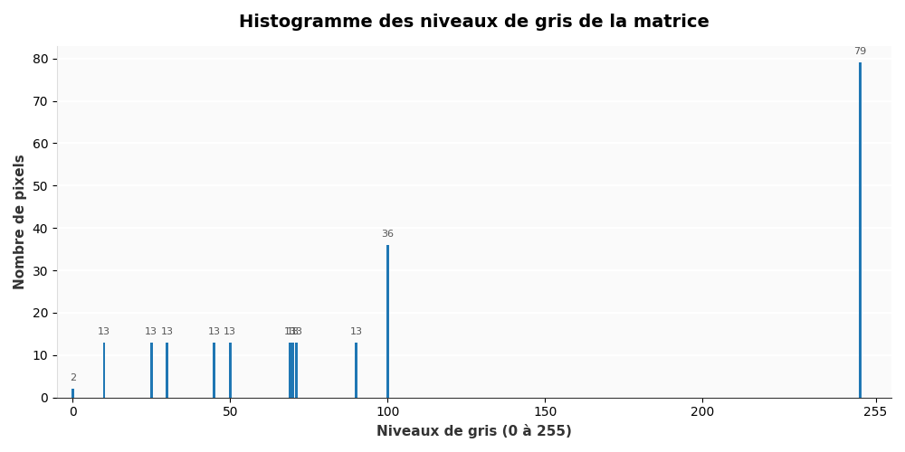
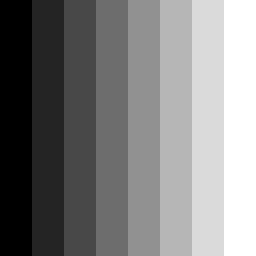
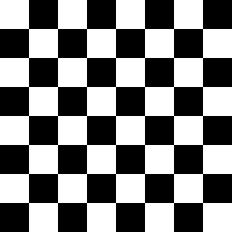
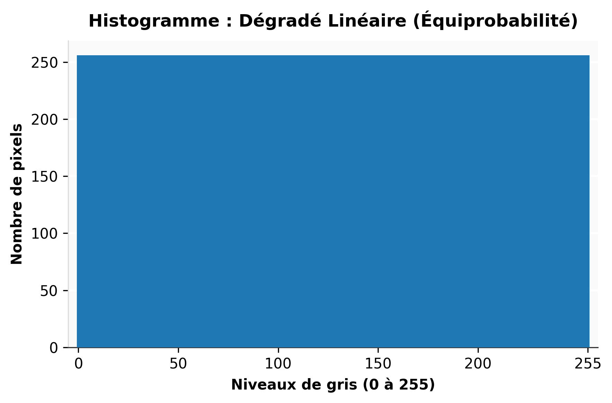
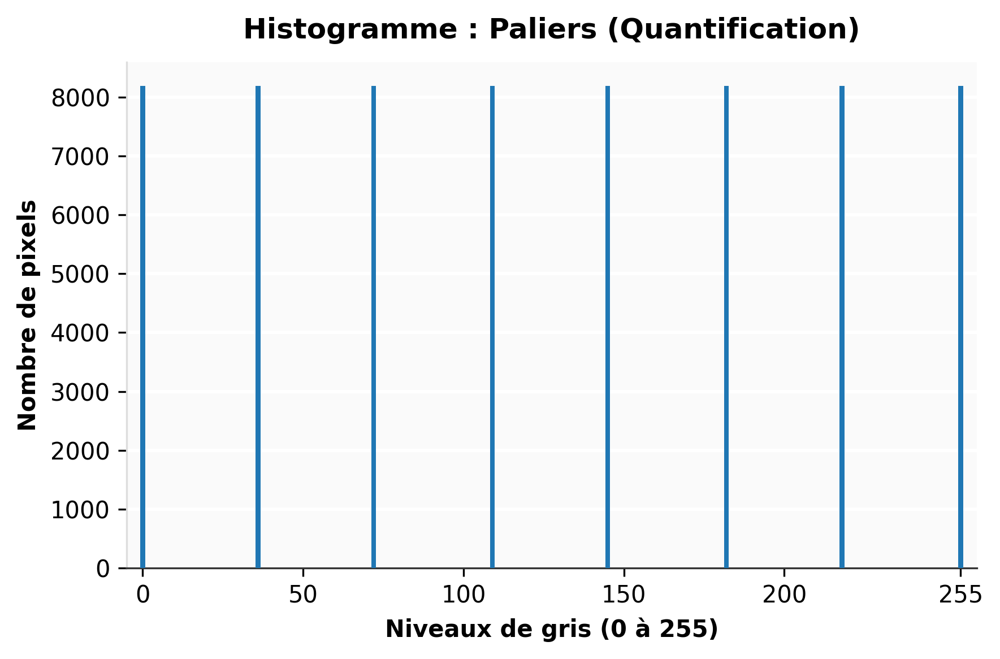
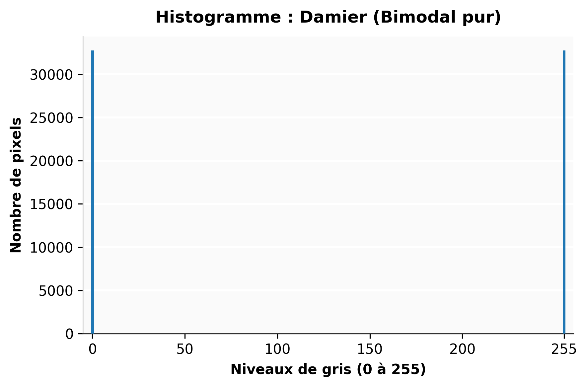
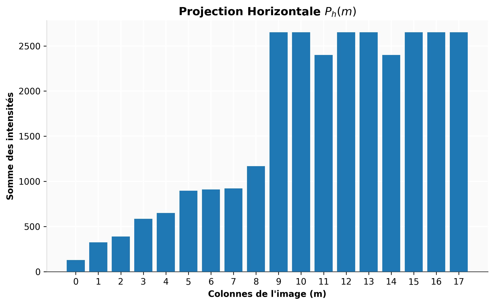
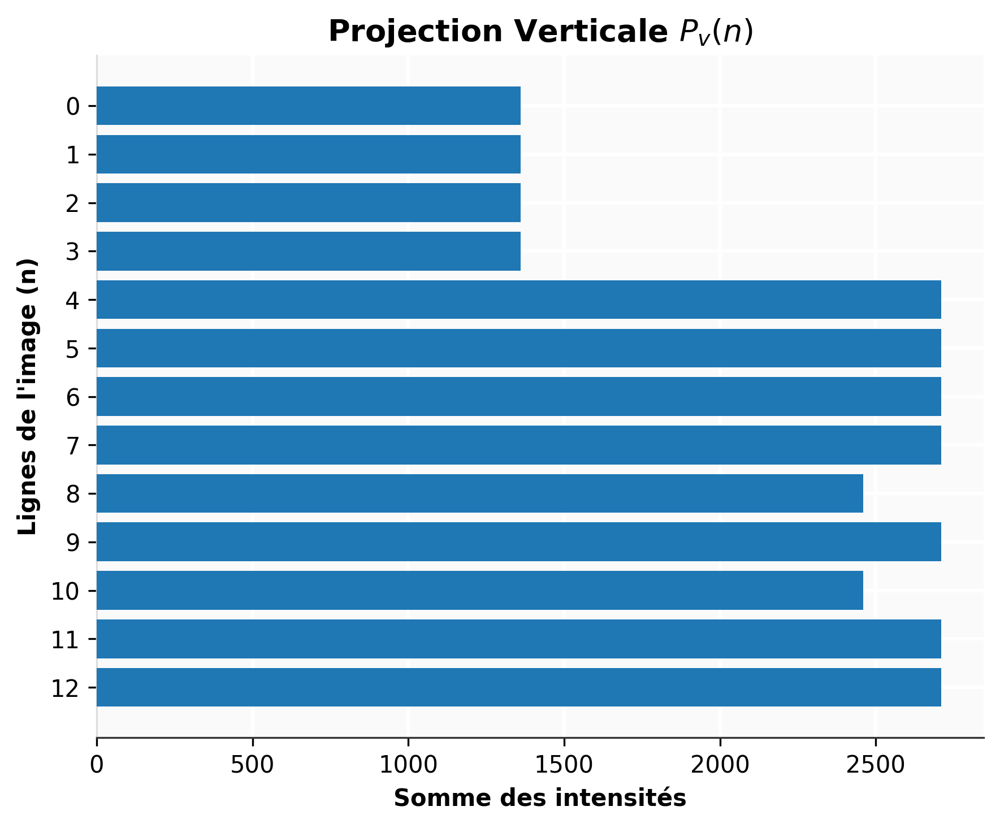

# Opérations statistiques

### Opérations statistiques

Les **opérations statistiques** (comme le calcul de l'histogramme ou des projections) n'altèrent pas directement l'image, mais en extraient des informations mathématiques globales sur la distribution et la géométrie des images. Elles constituent une étape d'analyse primordiale en vision industrielle pour automatiser la prise de décision, qu'il s'agisse de déterminer le seuil optimal d'une binarisation ou de localiser rapidement des anomalies de surface.

Considèrons une image comme étant définie par une matrice $N \times M$ de coordonnées $(n,m)$ avec $n=0,1,\dots,N-1$ et $m=0,1,\dots,M-1$ et que la valeur des pixels est établie par une échelle de gris notée $$g(n,m)$. 

## L'histogramme

Un graphique illustrant la probabilité d'apparition de chaque valeur de pixel dans une image est appelé un histogramme. Pour construire un histogramme, il faut d'abord compter le nombre total de pixels pour chaque valeur possible présente dans l'image (noté $n_f$). Ensuite, on divise chacun de ces décomptes par le nombre total de pixels de l'image ($N \times M$) pour obtenir la valeur de probabilité. Toutes ces valeurs sont représentées dans un graphique $\text{probabilité} = h_f(f)$, où $f$ représente le niveau de gris :

$$h_f(f) = \frac{n_f}{N \times M} \quad (6.1)$$

Cette méthode est généralement appliquée à une échelle de gris mais peut également être appliquée à une seule composante d'une couleur. Nous verrons plus tard que l'histogramme permet, par exemple, de choisir une table de correspondance (LookUpTable) ou une palette de couleurs.

Nous pouvons également définir l'histogramme cumulé $H_f(f)$ qui représente le pourcentage de pixels ayant un niveau de gris inférieur ou égal à $f$ :

$$H_f(f) = \sum_{j=0}^{f} h_f(j) \quad (6.2)$$

**Exemple :** À partir de maintenant, les exemples utiliseront cette matrice de nombres (qui peut représenter les niveaux de gris d'une image) :

```text
 10  25  30  45  50  69  70  71  90  100 100 100 100 100 100 100 100 100
 10  25  30  45  50  69  70  71  90  100 100 100 100 100 100 100 100 100
 10  25  30  45  50  69  70  71  90  100 100 100 100 100 100 100 100 100
 10  25  30  45  50  69  70  71  90  100 100 100 100 100 100 100 100 100
 10  25  30  45  50  69  70  71  90  250 250 250 250 250 250 250 250 250
 10  25  30  45  50  69  70  71  90  250 250 250 250 250 250 250 250 250
 10  25  30  45  50  69  70  71  90  250 250 250 250 250 250 250 250 250
 10  25  30  45  50  69  70  71  90  250 250 250 250 250 250 250 250 250
 10  25  30  45  50  69  70  71  90  250 250 250 250 250   0 250 250 250
 10  25  30  45  50  69  70  71  90  250 250 250 250 250 250 250 250 250
 10  25  30  45  50  69  70  71  90  250 250   0 250 250 250 250 250 250
 10  25  30  45  50  69  70  71  90  250 250 250 250 250 250 250 250 250
 10  25  30  45  50  69  70  71  90  250 250 250 250 250 250 250 250 250

```

{#fig-histogramme-exemple}

::: {.callout-note icon="false"}
### Exercice : Créer des images de test en niveaux de gris
Pour faire des exercices, nous allons créer trois images de test :
:::

::: {layout-ncol="2"}
{#fig-mire-degrade}
:::

::: {layout-ncol="2"}
{#fig-mire-paliers}
:::

::: {layout-ncol="2"}
{#fig-mire-damier}
:::


::: {.callout-note icon="false"}
### Exercice : Dessiner la LUT pour ces trois images
A partir des trois images précédemment créées, calculer et dessiner leur LUT respective.
:::

{#fig-hist-degrade}

*Le dégradé linéaire parfait distribue les pixels uniformément sur les 256 niveaux.*

{#fig-hist-paliers}

*L'échelle à paliers illustre le phénomène de quantification spatiale.*


{#fig-hist-damier}

*Le damier représente une distribution bimodale absolue, idéale pour démontrer le principe du seuillage.*


## Projection

La projection d'une image consiste à accumuler (sommer) ou moyenner les valeurs des amplitudes de pixels le long d'un axe spécifique (lignes ou colonnes). Cette opération permet de réduire une image bidimensionnelle en un profil unidimensionnel (une dimension). En vision industrielle, les projections sont extrêmement utiles pour détecter des décalages, segmenter des lignes de texte (OCR), redresser des grilles, ou identifier rapidement des anomalies de surface avec un coût de calcul très faible.

Mathématiquement, pour une image $u_{n,m}$ définie sur une grille $N \times M$ :

La **projection verticale** (somme le long de chaque ligne $n$) est définie par :


$$P_v(n) = \sum_{m=0}^{M-1} u_{n,m}$$

La **projection horizontale** (somme le long de chaque colonne $m$) est définie par :


$$P_h(m) = \sum_{n=0}^{N-1} u_{n,m}$$

**Exemple d'application sur notre matrice :**
Reprenons notre matrice de 13 lignes ($N=13$) et 18 colonnes ($M=18$). Calculons la projection verticale $P_v(n)$, c'est-à-dire la somme de l'intensité des pixels pour chaque ligne :

* **Lignes 1 à 4 :** $10 + 25 + ... + 90 + (9 \times 100) = 1360$
* **Lignes 5 à 8, 10, 12 et 13 :** $10 + 25 + ... + 90 + (9 \times 250) = 2710$
* **Ligne 9 :** Contient un 0 à la place d'un 250. Sa somme est donc $2710 - 250 = 2460$
* **Ligne 11 :** Contient également un 0. Sa somme est de $2460$

{#fig-projections-horiz}

{#fig-projections-vertic}

::: {.callout-tip title="L'intérêt des projections pour l'inspection industrielle"}
Dans cet exemple, sans avoir à analyser mathématiquement chaque pixel individuellement, la simple lecture du profil de projection verticale $P_v(n)$ montre une chute brutale de l'intensité aux lignes 9 et 11.

Si nous calculons la projection horizontale $P_h(m)$, nous observerons la même chute d'intensité (passant de 2650 à 2400) sur les colonnes 12 et 15. L'intersection de ces "creux" dans les profils 1D nous donne instantanément les coordonnées exactes des défauts (les pixels à 0) dans l'image 2D, ce qui est une méthode classique et ultra-rapide pour le contrôle qualité !
:::

::: {.callout-note icon="false"}
### Exercice : Réaliser des projections
Calculer et dessiner les projections horizontales et verticales des trois images de test créées précedement
:::

Outre l'histogramme et les projections, la vision industrielle (contrôle qualité, tri automatisé, guidage de robots) s'appuie massivement sur trois autres catégories de descripteurs statistiques. Dans un contexte industriel, l'objectif est toujours le même : réduire une matrice de plusieurs millions de pixels à quelques valeurs numériques scalaires pour qu'un automate puisse prendre une décision binaire (Accepter/Rejeter) en quelques millisecondes.

Voici les concepts incontournables que vous pouvez ajouter à votre cours `.qmd` :

## Les moments statistiques globaux (Analyse de la luminance)

Plutôt que d'analyser tout l'histogramme, on se contente souvent d'en extraire les moments statistiques fondamentaux. Ils permettent de vérifier instantanément si l'éclairage de l'usine a varié (dérive machine) ou si la caméra s'est déréglée.

Pour une image $u_{n,m}$ de taille $N \times M$ :

* **La Moyenne (Moment d'ordre 1) :**
Elle représente la luminosité globale de l'image (la composante continue).

$$\mu = \frac{1}{N \cdot M} \sum_{n=0}^{N-1} \sum_{m=0}^{M-1} u_{n,m}$$


* **L'Écart-type (Moment d'ordre 2 centré) :**
Il quantifie la dispersion des niveaux de gris autour de la moyenne, c'est-à-dire le **contraste macroscopique** de l'image. Une image "délavée" aura un écart-type très faible.

$$\sigma = \sqrt{\frac{1}{N \cdot M} \sum_{n=0}^{N-1} \sum_{m=0}^{M-1} (u_{n,m} - \mu)^2}$$

### Attention au dépassement de capacité (Overflow)

Lorsqu'on applique la formule naïve de la moyenne ($\sum u_{n,m}$) sur une image de grande dimension, on accumule des millions de valeurs. 

Prenons une image moderne en résolution 4K ($3840 \times 2160$ pixels), soit environ 8,3 millions de pixels. Si l'image est très claire (pixels proches de 255), la somme totale atteindra environ $2,1 \times 10^9$. 
Cette valeur frôle la limite absolue d'un entier signé sur 32 bits ($2^{31}-1 \approx 2,14 \times 10^9$). Sur une image de taille supérieure, la variable d'accumulation va déborder (overflow), repasser en négatif, et fausser totalement le calcul de la moyenne et de l'écart-type.

En vision par ordinateur, il existe trois méthodes pour contourner ce problème matériel :

#### L'approche "Data Science" : L'élévation de type (Casting)
C'est la solution de force brute utilisée par défaut dans les langages de haut niveau. Avant de commencer l'addition, on convertit la matrice d'entiers 8 bits (`uint8`) vers un type flottant 64 bits (`float64`). C'est exactement ce que fait la fonction `np.mean()` de NumPy sous le capot. L'inconvénient est que l'on multiplie par 8 la consommation de mémoire vive lors du calcul.

#### L'approche "Traitement d'images" : L'utilisation de l'histogramme
C'est la méthode la plus élégante et la plus optimisée. Puisque nous manipulons des images quantifiées sur 8 bits, il n'y a que 256 valeurs d'intensité possibles. Plutôt que d'additionner 8 millions de pixels un par un, il est mathématiquement équivalent, et beaucoup plus sûr, de se servir de l'histogramme $h(i)$ (qui contient le nombre de pixels pour chaque niveau de gris $i$).

La moyenne devient la somme de 256 termes seulement :
$$\mu = \frac{1}{N \cdot M} \sum_{i=0}^{255} i \cdot h(i)$$

L'écart-type se déduit de la même manière à partir de l'histogramme :
$$\sigma = \sqrt{\frac{1}{N \cdot M} \sum_{i=0}^{255} (i - \mu)^2 \cdot h(i)}$$
Cette méthode garantit qu'aucun débordement arithmétique ne se produira, tout en étant des milliers de fois plus rapide sur un processeur bas niveau.

#### L'approche "Streaming" : L'algorithme de Welford
Pour les flux vidéo en temps réel ou les systèmes très contraints en mémoire (où l'on ne peut stocker ni l'image complète ni l'histogramme), on calcule la moyenne et la variance itérativement. À chaque nouveau pixel $x_k$ reçu, la moyenne $\mu_k$ est mise à jour selon la différence avec la moyenne précédente :
$$\mu_k = \mu_{k-1} + \frac{x_k - \mu_{k-1}}{k}$$
Ici, la variable d'accumulation ne dépasse jamais la valeur 255.

### Exercices

::: {.callout-note icon="false"}
### Calcul de la moyenne et de l'écart type
Nous avons vu que la moyenne et l'écart-type mesurent deux caractéristiques distinctes d'une image (respectivement la luminosité globale et le contraste macroscopique/dispersion). 

Imaginez et décrivez la structure de deux images en niveaux de gris différentes qui possèdent *exactement* la même valeur moyenne, mais dont les écarts-types sont aux antipodes l'un de l'autre. Proposez deux approches différentes pour justifier votre réponse.
:::

::: {.callout-tip collapse="true" title="Voir la solution 1 : L'approche théorique (Cas d'école)"}
**Image A (Écart-type nul) :** 
Il suffit de concevoir une image parfaitement uniforme où tous les pixels possèdent exactement la même valeur (par exemple, la valeur 127 pour un gris parfait). La moyenne est de 127, et puisqu'il n'y a aucune dispersion autour de cette moyenne, l'écart-type est strictement égal à 0.

**Image B (Écart-type maximal) :** 
Il suffit de concevoir une image composée de 50 % de pixels noirs purs (0) et de 50 % de pixels blancs purs (254 ou 255). Peu importe leur disposition (damier géométrique ou bruit binaire aléatoire), la moyenne globale restera de 127. En revanche, tous les pixels étant situés aux extrêmes absolus de l'histogramme, la variance explose et l'écart-type atteint sa valeur maximale possible.
:::

::: {.callout-tip collapse="true" title="Voir la solution 2 : L'approche par dégradation (Bruit centré)"}
**Image A (Image d'origine) :** 
On choisit n'importe quelle photographie classique en niveaux de gris, qui possède donc une certaine moyenne et un certain écart-type de base.

**Image B (Image bruitée) :** 
On prend cette même photographie et on lui additionne un bruit artificiel (comme un bruit gaussien) très puissant, mais **strictement centré sur zéro** ($\mu_{bruit} = 0$). 
L'astuce mathématique est ici : l'ajout d'une matrice de bruit dont la moyenne est nulle ne modifie absolument pas la luminosité globale de l'image (la moyenne globale reste identique). Par contre, ce bruit disperse aléatoirement l'intensité de chaque pixel par rapport à sa valeur d'origine, ce qui fait inévitablement croître la variance et donc l'écart-type.
:::


## L'Entropie (Mesure de l'information et de la texture)

Issue de la théorie de l'information de Shannon, l'entropie mesure le degré de désordre ou d'imprévisibilité des pixels dans l'image.

Si $p_i$ est la probabilité d'apparition du niveau de gris $i$ (valeur issue de l'histogramme normalisé), l'entropie $H$ est :

$$H = - \sum_{i=0}^{255} p_i \log_2(p_i)$$

*Convention mathématique : si $p_i = 0$, on considère que $p_i \log_2(p_i) = 0$.*

**Usage industriel :**
L'entropie est très utilisée pour la **détection de flou** ou l'inspection de surfaces texturées (bois, textile, métal brossé). Une image parfaitement nette d'un circuit imprimé aura une forte entropie (beaucoup de variations nettes, d'arêtes et de détails), tandis que si la caméra est floue, l'image devient lisse, les niveaux de gris se moyennent, et l'entropie chute drastiquement. L'automate peut alors déclencher une alarme de perte de focus.

::: {.callout-note icon="false"}
### Exercice : Calcul de l'entropie de Shannon
Sans utiliser de code informatique, déduisez l'entropie théorique exacte des deux images de test que nous avons générées précédemment :

1. La `mire_damier.png` (50% de pixels noirs à 0, 50% de pixels blancs à 255).
2. La `mire_degrade.png` (Dégradé linéaire parfait où chaque niveau de gris de 0 à 255 est présent en quantité strictement égale).
::: 

::: {.callout-tip collapse="true" title="Voir la solution 1 : Entropie du Damier (Bimodal)"}
**Calcul pour le Damier :**
L'image ne contient que deux valeurs. La probabilité de tirer un pixel noir est $p_0 = 0,5$ et celle de tirer un pixel blanc est $p_{255} = 0,5$. Toutes les autres probabilités sont nulles.

En appliquant la formule :
$$H = - (p_0 \log_2(p_0) + p_{255} \log_2(p_{255}))$$
$$H = - (0,5 \cdot \log_2(0,5) + 0,5 \cdot \log_2(0,5))$$

Puisque $\log_2(0,5) = -1$ :
$$H = - (0,5 \cdot (-1) + 0,5 \cdot (-1)) = - (-0,5 - 0,5) = 1 \text{ bit}$$

**Conclusion :** Il suffit d'exactement $1$ bit d'information pour coder chaque pixel de cette image (noir ou blanc).
:::

::: {.callout-tip collapse="true" title="Voir la solution 2 : Entropie du Dégradé (Équiprobable)"}
**Calcul pour le Dégradé Linéaire :**
Ici, les 256 niveaux de gris sont présents en quantité égale. La probabilité d'apparition de chaque niveau de gris est donc constante : $p_i = \frac{1}{256}$.

En appliquant la formule sur les 256 termes :
$$H = - \sum_{i=0}^{255} \frac{1}{256} \log_2\left(\frac{1}{256}\right)$$

Puisque $\log_2\left(\frac{1}{256}\right) = -8$ :
$$H = - \sum_{i=0}^{255} \frac{1}{256} \cdot (-8)$$
$$H = - 256 \cdot \left( \frac{-8}{256} \right) = 8 \text{ bits}$$

**Conclusion :** L'entropie est maximale. Le désordre (la variété des niveaux de gris) est total. L'image contient 8 bits d'information par pixel, ce qui signifie qu'elle ne peut pas être compressée sans perte d'information.
:::

::: {.callout-note collapse="true" title="Implémentation Python (Vérification algorithmique)"}
En TP, le calcul de l'entropie nécessite une petite précaution technique : il faut retirer les probabilités nulles de l'histogramme avant de calculer le logarithme, pour éviter l'erreur mathématique `math domain error` (log de 0 n'existe pas).

```python
import cv2
import numpy as np

def calculer_entropie(chemin_image):
    img = cv2.imread(chemin_image, cv2.IMREAD_GRAYSCALE)
    
    # 1. Calcul de l'histogramme normalisé (Probabilités)
    valeurs, occurrences = np.unique(img, return_counts=True)
    probabilites = occurrences / img.size
    
    # 2. On filtre les probabilités strictement supérieures à 0
    p = probabilites[probabilites > 0]
    
    # 3. Formule de Shannon
    entropie = -np.sum(p * np.log2(p))
    return entropie

print(f"Entropie du Damier : {calculer_entropie('mire_damier.png'):.2f} bits")
print(f"Entropie du Dégradé : {calculer_entropie('mire_degrade.png'):.2f} bits")