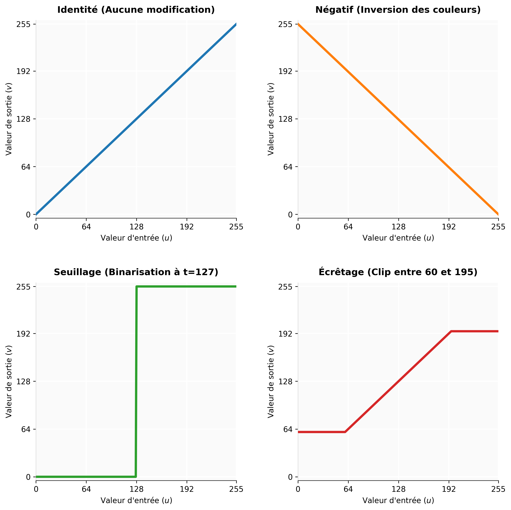

# Opérations ponctuelles

Les « opérations ponctuelles », également appelées opérations « pixel vers pixel », sont des transformations d'images dans lesquelles les valeurs des pixels individuels sont modifiées selon une opération notée :

$$g(n,m) = T_{n,m}(f(n,m))$$


*(si l'opérateur $T_{n,m}$ dépend de la position du pixel)*

ou par :

$$g(n,m) = T(f(n,m))$$


*(si la règle ne dépend pas de la position)*

---

## Opérations monadiques

Les opérations monadiques (ou unaires) sont des opérations pixel par pixel n'utilisant qu'une seule image en opérande.

### Le seuillage (Thresholding)

L'un des besoins les plus courants en transformation de pixels est la génération d'une représentation binaire d'une image. Les applications évidentes sont l'impression et l'analyse d'images. Cela consiste simplement à attribuer à chaque pixel un bit $0$ ou un bit $1$ (noir ou blanc). De nombreuses techniques existent (essentiellement pour l'impression), mais la plus simple consiste à définir un seuil. Si la valeur du pixel est supérieure au seuil, le bit devient $1$, sinon il devient $0$.

Pour une image d'entrée $u_{n,m}$ et un seuil défini $t$, l'opération ponctuelle de binarisation génère une image de sortie $v_{n,m}$ (composée classiquement de valeurs binaires 0 et 1) selon la règle mathématique suivante :

$$v_{n,m} = \begin{cases}  1 & \text{si } u_{n,m} > t \\  0 & \text{si } u_{n,m} \le t  \end{cases}$$

*(Note : Dans la pratique informatique sur 8 bits, comme illustré dans l'exemple de votre matrice, la valeur maximale 1 est généralement rééchelonnée à 255 pour correspondre au blanc pur).*

L'histogramme ou la projection peut nous aider à trouver une valeur de seuil. En regardant notre exemple précédent, il semble qu'une valeur située entre $120$ et $240$ sera probablement le bon seuil pour binariser cette image.

**Exemple d'application d'un seuil de 180 :**

```text
  0   0   0   0   0   0   0   0   0   0   0   0   0   0   0   0   0   0
  0   0   0   0   0   0   0   0   0   0   0   0   0   0   0   0   0   0
  0   0   0   0   0   0   0   0   0   0   0   0   0   0   0   0   0   0
  0   0   0   0   0   0   0   0   0   0   0   0   0   0   0   0   0   0
  0   0   0   0   0   0   0   0   0  255 255 255 255 255 255 255 255 255
  0   0   0   0   0   0   0   0   0  255 255 255 255 255 255 255 255 255
  0   0   0   0   0   0   0   0   0  255 255 255 255 255 255 255 255 255
  0   0   0   0   0   0   0   0   0  255 255 255 255 255 255 255 255 255
  0   0   0   0   0   0   0   0   0  255 255 255 255 255   0 255 255 255
  0   0   0   0   0   0   0   0   0  255 255 255 255 255 255 255 255 255
  0   0   0   0   0   0   0   0   0  255 255   0 255 255 255 255 255 255
  0   0   0   0   0   0   0   0   0  255 255 255 255 255 255 255 255 255
  0   0   0   0   0   0   0   0   0  255 255 255 255 255 255 255 255 255

```

### Les tables de correspondance (LUT - Look Up Tables)

Ces tables de correspondance permettent d'associer une valeur d'entrée à une valeur de sortie. La fonction $T$ est utilisée pour faire la liaison, permettant de modifier chaque valeur de pixel exactement selon nos besoins. Si nous traitons une image couleur, nous utiliserons trois tables (selon le mode de représentation TSL, RVB, etc.).

Sur une image en niveaux de gris non modifiée par une LUT, la fonction de transfert serait une simple ligne inclinée à 45°. Une LUT qui inverse l'image (effet négatif) serait représentée par une ligne inclinée à -45°.

Les avantages de l'utilisation d'une LUT par rapport à d'autres implémentations sont sa flexibilité et sa rapidité. Il suffit de recharger la table pour modifier l'opération. De plus, la LUT est une méthode très rapide puisqu'elle ne nécessite qu'un seul adressage indirect par pixel en mémoire.

Cette implémentation peut également être matérielle. Les circuits de sortie vidéo d'un système de vision industrielle sont souvent équipés de LUT matérielles, permettant de manipuler les contrastes et les couleurs instantanément.

**Exemples de LUT :**

| Nom de l'opération | Description mathématique | Paramètres |
| --- | --- | --- |
| **Seuillage** (Thresholding) | $g(x,y) = \begin{cases} 255 & \text{si } f(x,y) > t \\ 0 & \text{sinon} \end{cases}$ | $t$ : seuil |
| **Seuillage multiple** (Multi-thresholding) | Différents paliers de sortie conditionnés | $t_i$ : i-ème seuil, $l_i$ : i-ème niveau ($t_i < t_{i+1}$) |
| **Plancher** (Floor) | $g(x,y) = \max(f(x,y), c_f)$ | $c_f$ : plancher |
| **Plafond** (Ceiling) | $g(x,y) = \min(f(x,y), c_c)$ | $c_c$ : plafond |
| **Écrêtage** (Clip) | $g(x,y) = \min(\max(f(x,y), c_f), c_c)$ | $c_f$ : plancher, $c_c$ : plafond |
| **Décalage** (Offset) | $g(x,y) = f(x,y) + \text{offset}$ | offset |
| **Mise à l'échelle** (Scale) | $g(x,y) = \text{scale} \times f(x,y)$ | scale |
| **Carré** (Square) | $g(x,y) = f(x,y)^2$ |  |
| **Racine carrée** (Square root) | $g(x,y) = \sqrt{f(x,y)}$ |  |

{#fig-exemples-lut}

---

## Opérations dyadiques

Les opérations dyadiques sont des opérations pixel par pixel impliquant deux images opérandes (les deux images sont supposées avoir même largeur et même hauteur) :


$$g(x,y) = f_1(x,y) \circ f_2(x,y) \quad (6.3)$$

### La somme

La somme de deux images est calculée par l'addition des valeurs des pixels correspondants de chaque image. Nous pouvons également attribuer un facteur d'échelle à chaque image ($s_1$ et $s_2$) :


$$g(x,y) = s_1 f_1(x,y) + s_2 f_2(x,y) \quad (6.4)$$

### Minimum et maximum

Ces opérations découlent d'une comparaison entre deux images ou plus. Cela peut être utilisé, par exemple, pour extraire les valeurs maximales et minimales apparaissant au sein d'une séquence vidéo d'un objet filmé sur une période donnée.


$$g(x,y) = \min(f_1(x,y), f_2(x,y)) \quad (6.5)$$

$$g(x,y) = \max(f_1(x,y), f_2(x,y)) \quad (6.6)$$

### Opérations logiques

Tout comme les opérations arithmétiques standard, les opérations logiques bit à bit (bitwise) peuvent être appliquées pixel par pixel. Celles-ci incluent les opérateurs ET (AND), OU (OR), OU exclusif (XOR) et NON (NOT). Dans chaque cas, l'opération s'applique bit à bit sur les pixels correspondants et le résultat est placé à la position identique dans l'image résultante.

