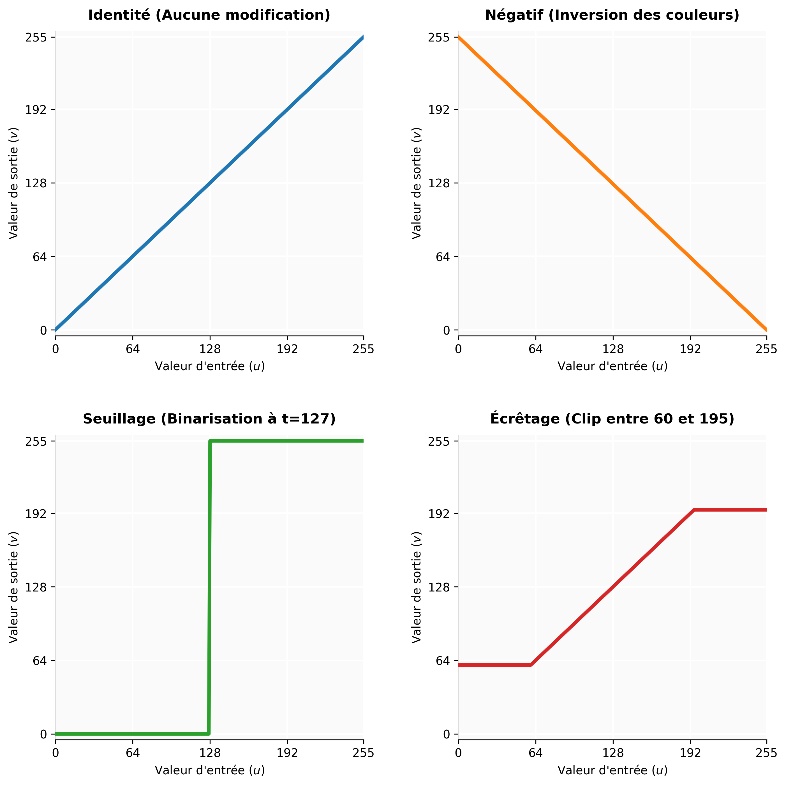

# Opérations ponctuelles

Les « opérations ponctuelles », également appelées opérations « pixel vers pixel », sont des transformations d'images dans lesquelles les valeurs des pixels individuels sont modifiées selon une opération notée :

$$g(n,m) = T_{n,m}(f(n,m))$$


*(si l'opérateur $T_{n,m}$ dépend de la position du pixel)*

ou par :

$$g(n,m) = T(f(n,m))$$


*(si la règle ne dépend pas de la position)*

---

## Opérations monadiques

Les opérations monadiques (ou unaires) sont des opérations pixel par pixel n'utilisant qu'une seule image en opérande.

### Le seuillage (Thresholding)

L'un des besoins les plus courants en transformation de pixels est la génération d'une représentation binaire d'une image. Les applications évidentes sont l'impression et l'analyse d'images. Cela consiste simplement à attribuer à chaque pixel un bit $0$ ou un bit $1$ (noir ou blanc). De nombreuses techniques existent (essentiellement pour l'impression), mais la plus simple consiste à définir un seuil. Si la valeur du pixel est supérieure au seuil, le bit devient $1$, sinon il devient $0$.

Pour une image d'entrée $u_{n,m}$ et un seuil défini $t$, l'opération ponctuelle de binarisation génère une image de sortie $v_{n,m}$ (composée classiquement de valeurs binaires 0 et 1) selon la règle mathématique suivante :

$$v_{n,m} = \begin{cases}  1 & \text{si } u_{n,m} > t \\  0 & \text{si } u_{n,m} \le t  \end{cases}$$

*(Note : Dans la pratique informatique sur 8 bits, comme illustré dans l'exemple de votre matrice, la valeur maximale 1 est généralement rééchelonnée à 255 pour correspondre au blanc pur).*

L'histogramme ou la projection peut nous aider à trouver une valeur de seuil. En regardant notre exemple précédent, il semble qu'une valeur située entre $120$ et $240$ sera probablement le bon seuil pour binariser cette image.

**Exemple d'application d'un seuil de 180 :**

```text
  0   0   0   0   0   0   0   0   0   0   0   0   0   0   0   0   0   0
  0   0   0   0   0   0   0   0   0   0   0   0   0   0   0   0   0   0
  0   0   0   0   0   0   0   0   0   0   0   0   0   0   0   0   0   0
  0   0   0   0   0   0   0   0   0   0   0   0   0   0   0   0   0   0
  0   0   0   0   0   0   0   0   0  255 255 255 255 255 255 255 255 255
  0   0   0   0   0   0   0   0   0  255 255 255 255 255 255 255 255 255
  0   0   0   0   0   0   0   0   0  255 255 255 255 255 255 255 255 255
  0   0   0   0   0   0   0   0   0  255 255 255 255 255 255 255 255 255
  0   0   0   0   0   0   0   0   0  255 255 255 255 255   0 255 255 255
  0   0   0   0   0   0   0   0   0  255 255 255 255 255 255 255 255 255
  0   0   0   0   0   0   0   0   0  255 255   0 255 255 255 255 255 255
  0   0   0   0   0   0   0   0   0  255 255 255 255 255 255 255 255 255
  0   0   0   0   0   0   0   0   0  255 255 255 255 255 255 255 255 255

```

### Les tables de correspondance (LUT - Look Up Tables)

Ces tables de correspondance permettent d'associer une valeur d'entrée à une valeur de sortie. La fonction $T$ est utilisée pour faire la liaison, permettant de modifier chaque valeur de pixel exactement selon nos besoins. Si nous traitons une image couleur, nous utiliserons trois tables (selon le mode de représentation TSL, RVB, etc.).

Sur une image en niveaux de gris non modifiée par une LUT, la fonction de transfert serait une simple ligne inclinée à 45°. Une LUT qui inverse l'image (effet négatif) serait représentée par une ligne inclinée à -45°.

Les avantages de l'utilisation d'une LUT par rapport à d'autres implémentations sont sa flexibilité et sa rapidité. Il suffit de recharger la table pour modifier l'opération. De plus, la LUT est une méthode très rapide puisqu'elle ne nécessite qu'un seul adressage indirect par pixel en mémoire.

Cette implémentation peut également être matérielle. Les circuits de sortie vidéo d'un système de vision industrielle sont souvent équipés de LUT matérielles, permettant de manipuler les contrastes et les couleurs instantanément.

**Exemples de LUT :**

| Nom de l'opération | Description mathématique | Paramètres |
| --- | --- | --- |
| **Seuillage** (Thresholding) | $g(x,y) = \begin{cases} 255 & \text{si } f(x,y) > t \\ 0 & \text{sinon} \end{cases}$ | $t$ : seuil |
| **Seuillage multiple** (Multi-thresholding) | Différents paliers de sortie conditionnés | $t_i$ : i-ème seuil, $l_i$ : i-ème niveau ($t_i < t_{i+1}$) |
| **Plancher** (Floor) | $g(x,y) = \max(f(x,y), c_f)$ | $c_f$ : plancher |
| **Plafond** (Ceiling) | $g(x,y) = \min(f(x,y), c_c)$ | $c_c$ : plafond |
| **Écrêtage** (Clip) | $g(x,y) = \min(\max(f(x,y), c_f), c_c)$ | $c_f$ : plancher, $c_c$ : plafond |
| **Décalage** (Offset) | $g(x,y) = f(x,y) + \text{offset}$ | offset |
| **Mise à l'échelle** (Scale) | $g(x,y) = \text{scale} \times f(x,y)$ | scale |
| **Carré** (Square) | $g(x,y) = f(x,y)^2$ |  |
| **Racine carrée** (Square root) | $g(x,y) = \sqrt{f(x,y)}$ |  |

{#fig-exemples-lut}


Dans OpenCV, l'opération vectorisée de LUT s'effectue grâce à la fonction :
```python
img_modifiee = cv2.LUT(img_source, table_lut)

```

### Exercice 1 : L'inversion d'image (Le Négatif)

L'inversion vidéo (ou négatif) d'une image consiste à remplacer le noir par du blanc, et inversement. Mathématiquement, la nouvelle valeur d'un pixel $p'$ à partir de sa valeur d'origine $p$ est : $p' = 255 - p$.

::: {.callout-important title="Exercice : Création d'une LUT simple"}

1. En utilisant la bibliothèque NumPy, générez un tableau de 256 éléments (de type `uint8`) qui contiendra notre LUT.
2. Remplissez ce tableau pour qu'à l'indice `0`, la valeur stockée soit `255`, et qu'à l'indice `255`, la valeur stockée soit `0`.
3. Appliquez cette LUT sur une image de votre choix avec `cv2.LUT()` et affichez le résultat.
:::

::: {.callout-tip collapse="true" title="Voir un indice pour la création du tableau NumPy"}
Vous pouvez créer la table de base avec `lut = np.arange(256, dtype=np.uint8)` puis appliquer votre opération vectorielle directement sur ce tableau de 256 valeurs avant de le passer à `cv2.LUT`.
:::


### Exercice 2 : La Correction Gamma et le "Benchmarking"

La correction Gamma est une transformation non-linéaire utilisée pour corriger la luminance d'une image (notamment pour l'adapter à la perception de l'œil humain ou aux caractéristiques d'un écran). La formule appliquée à chaque pixel d'intensité $I$ est :


$$O = 255 \times \left( \frac{I}{255} \right)^{\gamma}$$


*(Si $\gamma < 1$, l'image s'éclaircit. Si $\gamma > 1$, l'image s'assombrit).*

::: {.callout-important title="Exercice : Preuve de l'optimisation (Benchmark)"}
Votre objectif est de prouver empiriquement l'avantage algorithmique des LUTs.

1. **Méthode naïve :** Écrivez une fonction qui parcourt l'image avec une double boucle `for` (lignes, colonnes) et applique la formule mathématique du Gamma sur chaque pixel un par un avec `math.pow()`.
2. **Méthode optimisée :** Créez un tableau LUT de 256 valeurs contenant les résultats précalculés de la formule Gamma, puis appliquez-le avec `cv2.LUT()`.
3. **Benchmark :** Utilisez le module Python `time` pour chronométrer l'exécution des deux méthodes sur une grande image haute résolution (ex: 4K). Calculez le ratio d'accélération (Speedup). Que concluez-vous sur l'implémentation industrielle du traitement d'images ?
:::

### Exercice 3 : L'imagerie thermique (Pseudo-couleurs)

Une autre utilisation majeure des LUTs se trouve en imagerie médicale (radiographie) ou industrielle (caméras thermiques). Ces capteurs produisent des images en niveaux de gris (1 canal). L'œil humain distinguant beaucoup plus de nuances de couleurs que de nuances de gris, on applique une "Fausse couleur" (Pseudo-color) pour mettre en évidence certaines plages de valeurs.

Dans ce cas, la LUT ne remplace pas un gris par un autre gris, mais associe à chaque valeur de gris (de 0 à 255) un triplet $(Bleu, Vert, Rouge)$. L'image de sortie devient alors une image couleur à 3 canaux.

::: {.callout-important title="Exercice : Les Colormaps"}
OpenCV propose des LUTs de pseudo-couleurs prêtes à l'emploi via la fonction `cv2.applyColorMap()`.

1. Chargez une image en niveaux de gris.
2. Utilisez la fonction `cv2.applyColorMap()` avec la constante `cv2.COLORMAP_JET` (qui fait passer les valeurs sombres en bleu et les valeurs claires en rouge).
3. Sauvegardez le résultat. C'est exactement le principe utilisé par les caméras thermiques (ex: FLIR) pour afficher la chaleur sur les chantiers ou les circuits imprimés industriels.
4. (*Optionnel*) Cherchez dans la documentation OpenCV les autres tables de correspondance disponibles (comme `COLORMAP_HOT` ou `COLORMAP_BONE`) et testez-les.
:::

---

## Opérations dyadiques

Les opérations dyadiques sont des opérations pixel par pixel impliquant deux images opérandes (les deux images sont supposées avoir même largeur et même hauteur) :


$$g(x,y) = f_1(x,y) \circ f_2(x,y) \quad (6.3)$$

## Opérations arithmétiques (Dyadiques)

Contrairement aux opérations ponctuelles classiques qui transforment un pixel en fonction de sa propre valeur, les opérations dyadiques prennent en entrée **deux images** (de mêmes dimensions) pour produire une troisième image, en combinant mathématiquement leurs pixels correspondants : 
$$I_{out}(x,y) = I_1(x,y) \text{ [opérateur] } I_2(x,y)$$

Bien que triviales d'un point de vue mathématique, ces opérations constituent le socle de nombreuses applications de pointe en vision par ordinateur.

### L'Addition : Réduction de Bruit (Image Averaging)

L'addition de deux images (ou plus) est très utilisée pour le débruitage en astrophotographie, en imagerie médicale (rayons X), ou en photographie de nuit sur smartphone (mode "Night Sight").
La somme de deux images est calculée par l'addition des valeurs des pixels correspondants de chaque image. Nous pouvons éventuellement attribuer un facteur d'échelle à chaque image ($s_1$ et $s_2$) :

$$g(x,y) = s_1 f_1(x,y) + s_2 f_2(x,y) \quad (6.4)$$

**Exemple concret d'utilisation :**
Les capteurs numériques génèrent un "bruit thermique" aléatoire. Ce bruit (une sorte de grésillement sur l'image) change à chaque capture, tandis que l'objet réel photographié reste constant.
Si l'on photographie une même scène $N$ fois de suite très rapidement, et que l'on additionne ces images (puis qu'on divise la somme par $N$ pour faire une moyenne), le signal réel de l'objet s'accumule, tandis que le bruit aléatoire s'annule statistiquement (sa moyenne tend vers zéro). On obtient alors une image finale extrêmement nette dans des conditions de très faible luminosité.

*Exemple OpenCV :* `cv2.addWeighted(img1, 0.5, img2, 0.5, 0)` permet d'additionner deux images avec un poids égal de 50%.

### La Soustraction : Détection de mouvement et de défauts

La soustraction ($I_1 - I_2$) calcule la différence absolue entre deux images. C'est sans doute l'opération dyadique la plus utilisée dans l'industrie.

**Exemples concrets d'utilisation :**
*   **Détection d'intrusion (Vidéosurveillance) :** On capture l'image d'un parking vide (l'image de fond ou *background*). Chaque nouvelle image provenant de la caméra se voit soustraire cette image de fond. Si le résultat est proche de zéro (noir), rien n'a bougé. Si une silhouette apparaît en blanc dans l'image résultante, cela signifie qu'un objet (une personne, une voiture) vient de s'ajouter à la scène.
*   **Contrôle Qualité (Vision Industrielle) :** Sur une ligne de production, on compare la photographie d'un circuit imprimé sortant de l'usine avec la photographie de la "pièce parfaite de référence" (le Golden Master). La soustraction des deux images fera ressortir instantanément le moindre défaut (un composant manquant ou une soudure mal placée).
*   **Imagerie médicale (Angiographie) :** On prend une radio des vaisseaux sanguins avant l'injection d'un produit de contraste, puis une seconde après l'injection. La soustraction de la première image par la seconde fait disparaître les os et les tissus, ne laissant apparaître avec une clarté absolue que le réseau sanguin rempli par le produit.

*Attention :* En traitement d'images 8 bits, il ne peut pas y avoir de pixels négatifs. On utilise généralement la valeur absolue de la soustraction : `cv2.absdiff(img1, img2)`.

### La Multiplication : Le Masquage (Image Masking)

La multiplication pixel par pixel n'est quasiment jamais utilisée entre deux vraies photographies (le résultat serait visuellement chaotique et sombre). Son intérêt réside dans la multiplication d'une photographie par un **masque binaire**.

**L'intérêt concret :**
Un masque binaire est une image contenant uniquement des pixels noirs (valeur logique $0$) et des pixels blancs (valeur logique $1$).
En multipliant une photographie par ce masque, les zones correspondant au blanc ($I(x,y) \times 1 = I(x,y)$) sont conservées intactes, tandis que les zones correspondant au noir ($I(x,y) \times 0 = 0$) sont totalement effacées.

C'est la base du :
*   **Détourage et composition (Chroma Keying) :** La technologie du fond vert au cinéma. Une fois le vert identifié, on génère un masque binaire pour multiplier et effacer le fond, avant d'additionner un nouveau décor.
*   **Traitement localisé (Region of Interest - ROI) :** En imagerie satellitaire, si un algorithme doit analyser uniquement l'eau, on multiplie la vue satellite par un masque géographique qui met les terres émergées à zéro. L'algorithme ne traitera ensuite que les pixels non nuls, économisant ainsi des temps de calcul massifs.


### Le Minimum et le Maximum (Fusion sélective)

Ces opérations découlent d'une comparaison entre deux images ou plus. Cela peut être utilisé, par exemple, pour extraire les valeurs maximales et minimales apparaissant au sein d'une séquence vidéo d'un objet filmé sur une période donnée.

$$g(x,y) = \min(f_1(x,y), f_2(x,y)) \quad (6.5)$$

$$g(x,y) = \max(f_1(x,y), f_2(x,y)) \quad (6.6)$$

**Exemples concrets :**

*   **Le Maximum (Génération de filés d'étoiles / Star Trails) :** En astrophotographie, si l'on prend des centaines de photos du ciel nocturne depuis un trépied fixe, la Terre tourne mais le fond du ciel reste noir. En appliquant un opérateur `MAX` sur toute la pile d'images, on ne conserve à chaque position que le pixel le plus lumineux (l'étoile). Le résultat est une image montrant la trajectoire circulaire des étoiles sans pour autant surexposer le ciel de fond (ce qui arriverait avec une simple addition).
*   **Le Minimum (Extraction de fond) :** À l'inverse, imaginez une caméra filmant une rue passante en plein jour. Si l'on compile 100 images de cette rue avec l'opérateur `MIN`, les voitures blanches ou claires qui passent seront ignorées au profit de l'asphalte gris foncé qui se trouve derrière elles. C'est une technique redoutable pour "effacer" les objets clairs en mouvement et reconstituer le décor vide.

*Exemples OpenCV :* `cv2.max(img1, img2)` et `cv2.min(img1, img2)`.


### Les Opérateurs Logiques (AND, OR, XOR)

Tout comme les opérations arithmétiques standard, les opérations logiques bit à bit (bitwise) peuvent être appliquées pixel par pixel. Celles-ci incluent les opérateurs ET (AND), OU (OR), OU exclusif (XOR) et NON (NOT). 
Dans chaque cas, l'opération s'applique bit à bit sur les pixels correspondants et le résultat est placé à la position identique dans l'image résultante.

En traitement d'images, on les utilise donc presque exclusivement sur des **images binaires** (noir et blanc). 

Pour un informaticien, ces opérations sont fondamentales car elles sont exécutées directement par l'ALU (Unité Arithmétique et Logique) du processeur. Elles sont donc infiniment plus rapides qu'une multiplication arithmétique.

**L'intérêt concret de l'opérateur ET (AND) : L'Extraction optimisée**

L'opérateur `AND` logique est la méthode standard dans l'industrie pour appliquer un masque (plutôt que la multiplication abordée précédemment). 
*   $1 \text{ AND } 1 = 1$ (Le pixel est conservé)
*   $1 \text{ AND } 0 = 0$ (Le pixel est effacé)
*   *Application :* Pour isoler un visage détecté par un algorithme IA, on crée un masque binaire en forme d'ellipse autour du visage. Un simple `cv2.bitwise_and(img_originale, img_originale, mask=masque_visage)` permet de mettre à zéro tout le reste de l'image de manière ultra-optimisée, préparant l'image pour un algorithme de reconnaissance faciale.

**L'intérêt concret de l'opérateur OU (OR) : La fusion de masques**

L'opérateur `OR` permet d'additionner des conditions géométriques ou des régions d'intérêt.
*   *Application :* Supposons qu'un algorithme de vision pour véhicule autonome génère un masque binaire contenant les piétons (Masque A) et un autre algorithme génère un masque contenant les cyclistes (Masque B). 
Pour obtenir la carte globale des "humains à éviter", on ne fait pas une addition mathématique (qui risquerait de créer des dépassements de capacité si un piéton et un vélo se superposent), on utilise un OU logique : `cv2.bitwise_or(masque_A, masque_B)`. Les deux régions fusionnent parfaitement.

**L'intérêt concret du OU EXCLUSIF (XOR) : La détection de changement**

L'opérateur `XOR` renvoie vrai uniquement si les deux pixels sont différents. 
*   *Application :* Si on compare le masque binaire d'une tumeur médicale généré au mois de janvier avec celui du même patient au mois de mars, un `cv2.bitwise_xor(masque_janvier, masque_mars)` affichera uniquement les zones où la tumeur a grossi ou rétréci. Les zones restées identiques (qu'elles soient de la tumeur ou du tissu sain) s'annuleront et deviendront noires.
