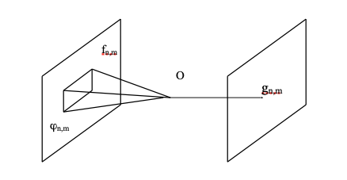

# Opérations de voisinage

Contrairement aux opérations ponctuelles (pixel à pixel), la valeur d'un pixel de sortie lors d'une opération de voisinage dépend d'un sous-ensemble de pixels d'entrée.

{#fig-voisinage}

Le **voisinage local** d'un pixel $(n,m)$ est l'ensemble des pixels situés dans une sous-région de l'image entourant le pixel $(n,m)$. Généralement, cette sous-région est rectangulaire, avec $(n,m)$ en son centre. Si l'on suppose que la taille du voisinage est $(2K+1) \times (2L+1)$, alors le voisinage local $\phi_{n,m}$ du pixel $(n,m)$ dans l'image d'entrée $f$ est défini par :

$$ \phi_{n,m} = \{ f_{i,j} \mid n-K \le i \le n+K, \quad m-L \le j \le m+L \} $$

Nous pouvons modéliser mathématiquement ces opérations par :

$$ g_{n,m} = O(\phi_{n,m}) $$

Cette opération est qualifiée de **linéaire** si elle respecte le principe de superposition :

$$ O(a \cdot \phi_1 + b \cdot \phi_2) = a \cdot O(\phi_1) + b \cdot O(\phi_2) $$

## Masques

Un masque (ou noyau) est défini par une matrice de pondération $h_{k,l}$, une norme de normalisation $N$ et éventuellement un seuil $\sigma$.

$$
h = \begin{bmatrix}
h_{-K,-L} & h_{-K,-L+1} & \dots & h_{-K,L} \\
h_{-K+1,-L} & & & \dots \\
\dots & & & \\
h_{K,-L} & \dots & \dots & h_{K,L}
\end{bmatrix}
$$

Le masque $h$ est utilisé pour calculer la nouvelle valeur des pixels $g_{n,m}$ selon l'équation suivante :

$$ g_{n,m} = \frac{1}{N} \sum_{k=-K}^{K} \sum_{l=-L}^{L} h_{k,l} f_{n-k, m-l} $$

De manière générale, $N$ est égal à la somme des coefficients du masque pour conserver la luminance globale de l'image :

$$ N = \sum_{k=-K}^{K} \sum_{l=-L}^{L} h_{k,l} $$

Si un seuil $\sigma$ est défini (pour ne modifier le pixel que si le changement est significatif), la nouvelle valeur devient :

$$ g_{n,m} = \begin{cases} \text{Nouvelle valeur calculée} & \text{si la différence } > \sigma \\ f_{n,m} & \text{sinon} \end{cases} $$

Pour traiter l'image, on "glisse" ce masque pixel par pixel, de gauche à droite et de haut en bas. Ces équations sont valides pour $n \ge K$, $n < N-K$, $m \ge L$ et $m < M-L$. 

**Gestion des effets de bord :**
Une ambiguïté survient près des bords de l'image car le voisinage local "déborde" de l'image. Trois méthodes classiques permettent de résoudre ce problème :

1. **Ignorer les bords :** L'image de sortie n'est pas calculée sur une épaisseur correspondant au rayon du masque.
2. **Zero-padding :** L'image d'entrée est virtuellement entourée de zéros au-delà de ses limites.
3. **Répétition périodique :** L'image est répétée comme un motif continu (le bord droit "touche" le bord gauche).

## Convolution

Dans l'équation de l'opération de voisinage, si l'opérateur $O(\cdot)$ ne dépend pas de la position spatiale du pixel $(n,m)$, l'opération est dite **invariante dans l'espace**. Si, en plus, l'opération est linéaire, on parle alors de **convolution discrète**. Les masques vus précédemment sont utilisés pour calculer cette convolution.

### Filtrage Passe-bas (Low-pass)

Les filtres passe-bas laissent passer les basses fréquences (les aplats de couleurs) sans modification, mais atténuent les hautes fréquences (les détails fins et le bruit). On les appelle souvent **filtres de lissage** (smoothing filters).

### Moyenne locale
La moyenne locale (ou opérateur de lissage) remplace la valeur d'un pixel par la moyenne de son voisinage. Mathématiquement, pour un masque $3 \times 3$, tous les coefficients $h_{k,l}$ valent $1$ et la norme est $N=9$ :

$$ H_{\text{moyenne}} = \frac{1}{9} \begin{bmatrix} 1 & 1 & 1 \\ 1 & 1 & 1 \\ 1 & 1 & 1 \end{bmatrix} $$

*Exemple de calcul :* Si le pixel central vaut 12 et ses 8 voisins valent 59, 72, 67, 76, 54, 73, 69 et 71.
La moyenne est $\frac{12 + 59 + 72 + 67 + 76 + 54 + 73 + 69 + 71}{9} = \frac{553}{9} \approx 61$.

### Filtre Gaussien
Le filtrage gaussien utilise une distribution normale. La fonction gaussienne 2D étant séparable, le filtre peut être implémenté comme une cascade d'opérations (lignes puis colonnes). Voici l'approximation classique d'un masque gaussien $3 \times 3$ (avec $N=16$) :

$$ H_{\text{gaussien}} = \frac{1}{16} \begin{bmatrix} 1 & 2 & 1 \\ 2 & 4 & 2 \\ 1 & 2 & 1 \end{bmatrix} $$

---

### Filtrage Passe-haut (High-pass)

Les filtres passe-haut atténuent les basses fréquences pour ne conserver (ou amplifier) que les hautes fréquences, c'est-à-dire les variations brusques d'intensité (les contours). 
Puisque le passe-bas et le passe-haut sont complémentaires, un filtrage passe-haut peut être obtenu en soustrayant l'image lissée (passe-bas) de l'image originale :

$$ \text{Passe-haut} = \text{Image Originale} - \text{Passe-bas} $$

Par exemple, la contrepartie passe-haut du filtre gaussien s'écrit (sans normalisation $N$) :
$$ H_{\text{passe-haut\_gaussien}} = \begin{bmatrix} -1 & -2 & -1 \\ -2 & 12 & -2 \\ -1 & -2 & -1 \end{bmatrix} $$

Voici deux autres masques passe-haut classiques :
$$ H_{1} = \begin{bmatrix} -1 & -1 & -1 \\ -1 & 9 & -1 \\ -1 & -1 & -1 \end{bmatrix} \quad \text{et} \quad H_{2} = \begin{bmatrix} -1 & -2 & -1 \\ -2 & 13 & -2 \\ -1 & -2 & -1 \end{bmatrix} $$

---

### Détection de contours : Autres filtres linéaires

Différents masques permettent de détecter des caractéristiques géométriques spécifiques. Voici les principaux filtres de détection de gradients matriciels :

**Filtres de Sobel (Détection directionnelle) :**
$$ H_{\text{vertical}} = \begin{bmatrix} -1 & 0 & 1 \\ -2 & 0 & 2 \\ -1 & 0 & 1 \end{bmatrix} \quad H_{\text{horizontal}} = \begin{bmatrix} -1 & -2 & -1 \\ 0 & 0 & 0 \\ 1 & 2 & 1 \end{bmatrix} $$

**Filtres de Prewitt :**
$$ H_{\text{vertical}} = \begin{bmatrix} -1 & 0 & 1 \\ -1 & 0 & 1 \\ -1 & 0 & 1 \end{bmatrix} \quad H_{\text{horizontal}} = \begin{bmatrix} -1 & -1 & -1 \\ 0 & 0 & 0 \\ 1 & 1 & 1 \end{bmatrix} $$

**Filtres Isotropes :**
$$ H_{\text{vertical}} = \begin{bmatrix} -1 & 0 & 1 \\ -\sqrt{2} & 0 & \sqrt{2} \\ -1 & 0 & 1 \end{bmatrix} \quad H_{\text{horizontal}} = \begin{bmatrix} -1 & -\sqrt{2} & -1 \\ 0 & 0 & 0 \\ 1 & \sqrt{2} & 1 \end{bmatrix} $$

**Filtres Laplaciens (Détection omnidirectionnelle) :**
$$ H_{\text{Laplace 1}} = \begin{bmatrix} 0 & -1 & 0 \\ -1 & 4 & -1 \\ 0 & -1 & 0 \end{bmatrix} \quad H_{\text{Laplace 2}} = \begin{bmatrix} -1 & -1 & -1 \\ -1 & 8 & -1 \\ -1 & -1 & -1 \end{bmatrix} $$

::: {.callout-note title="Filtre de Canny"}
L'algorithme de Canny est une méthode multi-étapes sophistiquée pour la détection de contours (incluant un lissage gaussien, le calcul du gradient, la suppression des non-maxima et un seuillage par hystérésis). Pour plus de détails mathématiques : [Canny edge detector (Wikipedia)](https://en.wikipedia.org/wiki/Canny_edge_detector).
:::

---

## Filtres non-linéaires

### Filtre Médian
Le filtre non-linéaire le plus courant est le filtre médian, particulièrement efficace pour éliminer le bruit impulsionnel ("poivre et sel") tout en préservant la netteté des contours.

Il ne s'agit pas d'un masque multiplicatif. L'algorithme trie toutes les valeurs des pixels présents dans la fenêtre locale et remplace le pixel central par la valeur située au milieu de cette liste triée.

*Exemple :* Soit les valeurs dans une fenêtre $3 \times 3$ : 59, 72, 67, 76, 76, 12, 54, 73, 69, 71.
1.  Tri croissant : 12, 54, 59, 67, **69**, 71, 72, 73, 76.
2.  La valeur médiane est **69**.

L'avantage majeur de ce filtre est de conserver les arêtes franches de l'image. Son inconvénient apparaît lorsque le rapport signal-sur-bruit est très faible, car il peut alors générer des cassures artificielles et de faux contours.

**Amélioration (MTM - Modified Trimmed Mean) :** 
Pour affiner ce filtre, on peut fixer un seuil (ne remplacer le pixel que si l'écart est significatif) ou utiliser un filtre MTM. Dans ce cas, on calcule la médiane, mais on ne garde pour la moyenne que les valeurs voisines proches de cette médiane, éliminant ainsi les valeurs aberrantes (outliers) avant de lisser.

### Local Binary Pattern (LBP)

Les motifs binaires locaux (LBP) sont conçus pour repérer des structures répétitives dans une image. Principalement utilisés pour la classification et la reconnaissance de textures, ils peuvent également caractériser localement des contours ou des coins.

L'algorithme LBP de base se calcule ainsi :

1.  Pour chaque pixel $p$ disposant de 8 voisins immédiats.
2.  Initialiser un octet (8 bits numérotés de $b_0$ à $b_7$) à zéro.
3.  Pour chacun des 8 voisins $v$ (parcourus dans le sens horaire) :
    *   Calculer la différence d'intensité entre ce voisin $v$ et le pixel central $p$.
    *   Si l'intensité de $v \ge p$ (différence positive ou nulle), le bit correspondant prend la valeur $1$.
    *   Sinon, il reste à $0$.
4.  L'octet binaire final est converti en valeur décimale (de 0 à 255), qui devient la nouvelle valeur du pixel $p$.